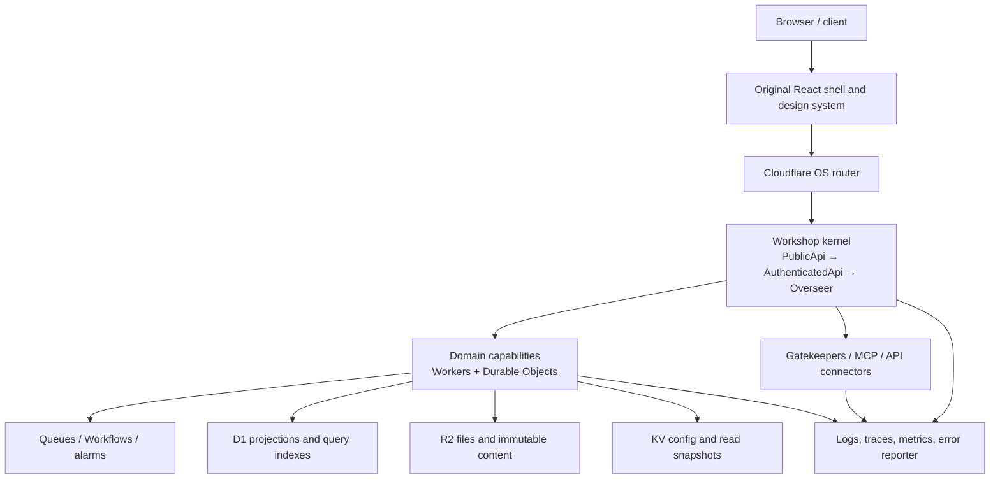

# Target Cloudflare architecture

## Architectural posture

Outreach OS supplies the deployable wrapper and a pinned Cloudflare OS. The target product should extend that platform with original React surfaces, domain workers/Durable Objects, Gatekeepers/connectors, projections, and migration tooling.

## Existing Cloudflare OS primitives to adopt

- React SPA and router-served asset model.
- Cap’n Web RPC over the `/api` WebSocket session.
- Per-user state in `UserDurableObject`.
- Per-workspace runtime in `OverseerDurableObject`.
- Gadget/workpiece model and sandboxed UI/server facets.
- Gatekeeper capability model for external systems.
- Approval queue, auto-approval rules, hooks, scheduler, and agent spawners.
- Blueprints and output formats.
- Admin configuration, branding, and connector policy.
- Typed storage over Durable Object storage.
- KV/R2 bindings and wrapper deploy discipline.

## New layers expected in the rewrite

### Product shell

A wrapper-owned React application that recreates Neuwave’s product navigation, split behavior, list/Soup experience, blocks, command palette, and business surfaces while speaking the Cloudflare OS RPC contract.

A stock-shell or hybrid decision must be recorded as an ADR. The end goal described by the owner points toward a custom shell, but the first pass must estimate the compatibility cost rather than assume it.

### Domain control plane

A small set of shared packages should establish:

- actor/request context;
- identity and tenant context;
- authorization receipts;
- entity identifiers and ontology;
- typed errors;
- event envelope;
- idempotency keys;
- outbox and projection checkpoints;
- tracing/correlation;
- secret/config boundaries.

### Domain capabilities

Domains should expose typed RPC capabilities or service-binding interfaces. HTTP routes are reserved for physical protocol needs such as webhooks, OAuth callbacks, file delivery, streaming protocols, and `/.well-known` endpoints.

### Query/projection plane

Neuwave’s cross-entity Soup, search, recents, favorites, activity, and notifications require a deliberate projection/index architecture. They cannot be recreated by making the shell fan out to dozens of authoritative Durable Objects on every render.

## Primitive-selection guide

| Requirement | First candidate | Caution |
|---|---|---|
| Single authoritative aggregate, serialized writes | Durable Object | Define sharding and hot-key limits. |
| Cross-aggregate relational/query surface | D1 | Do not make D1 an unowned write free-for-all. |
| Large binary/immutable objects | R2 | Keep metadata and authorization separate. |
| Read-mostly configuration/snapshots | KV | Eventual consistency; not an authority for conflicting writes. |
| Durable asynchronous fan-out | Queues | Define idempotency, poison handling, replay, and ordering key. |
| Multi-step long-running orchestration | Workflows or DO alarms | Confirm duration, compensation, and visibility requirements. |
| Lexical search | D1 FTS or dedicated index | Verify seven-source ranking and freshness requirements. |
| Semantic retrieval | Vectorize | Keep source-of-truth and deletion propagation explicit. |
| Existing relational system during migration | Hyperdrive | Transitional dependency, not an excuse to preserve the old topology forever. |
| Browser/PDF rendering | Browser Rendering | Keep the deliberate self-hosted converter exception isolated if it remains. |

## Kernel-change budget

Kernel changes are allowed only when all of these are true:

1. The required concept cannot be expressed through the current API, Gatekeepers, gadgets, wrapper workers, or a custom shell.
2. A compatibility impact report exists.
3. Upgrade and rebase cost is estimated.
4. The change is isolated and tested.
5. An ADR records why an edge extension was insufficient.
