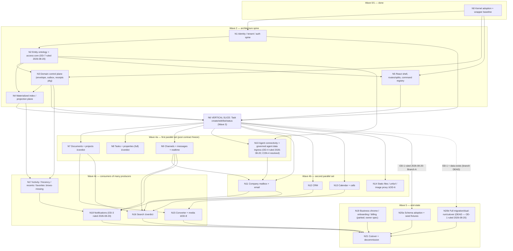

# 05 — Implementation build graph

Date: 2026-08-20. WP-030 part C (build graph + vertical-slice recommendation).
Status: first pass, generated from evidence; frozen only after the owner decisions in
`reports/06-owner-decisions-needed.md` marked **[graph-blocking]** are answered.

> **Status update — rulings applied 2026-08-20** (registry of record:
> `reports/06-owner-decisions-needed.md`; each item below is authoritative over any
> contrary pre-ruling annotation in this graph):
>
> - **OD-1 ruled: N20a selected; N20b is dead.** Fresh start — no live data migrates;
>   old Postgres schemas are design reference only; ADR-013 Accepted on Branch A.
>   The slice's "migration fixture" means Branch-A seed fixtures; OD-14 and OD-22
>   lose their Branch-B relevance (shape-from-code suffices for G-006).
> - **OD-7 ruled — the slice is unblocked.** Task stays a **document facet**
>   (document + `sub_type='task'` + TASK property bundle), per the audit at
>   `reports/notes/od7-task-treatment-audit.md`; thread = EmailThread (already
>   first-class). N2 and N6 lose their hardest block; the slice keeps Task as its
>   subject, now exercising document + facet + properties.
> - **OD-4 ruled — N10 confirmed as the first track of wave 4a** (CON-4 resolved as
>   this graph recommends), with clarified intent: connectivity IS the sandboxed
>   agent's **governed data-ingress** capability (the Cloudflare sandboxed agent
>   cannot currently ingest data from MCPs or external APIs); N10's scope statement
>   leads with "sandboxed agent can read external data through governed connectors
>   (Gatekeepers/MCP)".
> - **OD-11 ruled — N5 (shell) scope updated: no permanent embeds.** ALL screens are
>   rebuilt from scratch to 1:1 Neuwave parity, including surfaces the stock kernel
>   shell provides; stock kernel screens transitional only, same parity bar (ADR-001
>   Accepted with amendment).
> - **OD-16 ruled — N1 (auth) consumes the kernel `PublicApi`/`LoginAttempt` flow
>   directly**; deferral B closed; no legacy mounts.
> - **OD-27 ruled** — one D1 projection plane, two schema families, shared consumer
>   framework (fixes the N4/N16 consumer split; ADR-006/ADR-007 may finalize).
> - **OD-3 ruled** — N18 kept: in-app + email digests; mobile push deferred until a
>   native client exists (ledger-row transcription rides the OD-5 batch).
> - **OD-10 ruled** — zero-kernel-patch budget bound from wave 0 (N0 governance;
>   ADR-014 Accepted).
> - **OD-5 mode ruled — batch ruling session**; the owner rules all 57 unruled rows
>   in batches (packet: `reports/notes/od5-batch-ruling-packet.md`). **⧖verdict**
>   markers below therefore remain standing until the batch completes; only the
>   named ODs above are cleared.

Evidence pins (all read-only, verified in `reports/00-baseline-verification.md`):

- Implementation worktree @ `dec12f2df3d205965838526076b910cdb8a845ce`; `cloudflare-os` @ `bf7f762d7fa73553284d731ab6a978d3ea17be24`.
- Neuwave reference @ `9f7a26bccb85e6f806a6e0c8d6c8e53f3a3541bf`.
- Canonical ledger: branch `research/nuewave-longtail` @ `13c2847543326f8c2ce8485b26a1c1f0520cfa1b`, `docs/plans/nuewave-native/merge/merge-ledger.md` (+ `roadmap.md`, `merge/README.md`, `merge/route-reconciliation.md`, `merge/pattern-review.md`).
- Wave-1 inputs: `reports/01-plan-gap-review.md`, `reports/02-rpc-compatibility-ledger.csv` (182 rows), `reports/03-command-hotkey-ledger.csv` (387 rows), `reports/notes/*`.

Verdict-status caveat (PB-1): 57 of 101 ledger rows carry research but **no explicit verdict** and
are covered only by the Q19 default-KEEP ruling. Nodes whose *scope* (not just size) depends on a
pending verdict are marked **⧖verdict** below and enumerate the pending rows. This graph treats
Q19-default as binding for scope but does **not** freeze any structural choice the default cannot
make (row splits, substrate choices, missing rows) — those route to OD entries.

ADR numbering follows the drafts landed by the sibling WP-030 packet under `reports/adrs/`
(all fourteen present and cross-checked at write time):

| ADR | Topic (per `reports/adrs/` drafts) |
|---|---|
| ADR-001 | Custom shell vs stock/hybrid shell (custom React shell + command-registry architecture; OD-11) |
| ADR-002 | API/RPC compatibility boundary (182-row kernel freeze; wrapper capabilities; OD-12) |
| ADR-003 | Entity registry and canonical entity identifiers (OD-7, 1a rider) |
| ADR-004 | Authorization receipts and policy model |
| ADR-005 | DO / D1 / R2 / KV / Queue / Workflow / projection ownership rules (event envelope, outbox) |
| ADR-006 | Soup and cross-entity materialized indexes |
| ADR-007 | Seven-entity-type search (corrected framing per 01 §2.5 E2; OD-15) |
| ADR-008 | Sync and collaboration — two CRDT planes (OD-13) |
| ADR-009 | Channels, notifications, and realtime delivery (OD-3 gate cleared — Ruled 2026-08-20: in-app + digests, push deferred) |
| ADR-010 | Safe file, unfurl, image, and external-fetch behavior |
| ADR-011 | SSRF controls on Workers — safe-fetch (the OD-6 design proposal) |
| ADR-012 | Self-hosted converter boundary — LibreOffice + ffmpeg (OD-8, OD-2) |
| ADR-013 | Migration and cutover — Accepted, Branch A (OD-1 Ruled 2026-08-20; Branch B dead; OD-14 moot) |
| ADR-014 | Kernel-change and upstream-patch budget (OD-10) |

Note: no dedicated agent-connectivity ADR exists; the connectivity layer (N10) is governed by the
ledger's P1-centerpiece ruling + ADR-002's capability boundary. If the owner wants a dedicated
connectivity ADR, it takes the next free number (ADR-015).

---

## 1. Foundational-contract rule (applied throughout)

Per `10-DELIVERY-PLAN.md` §Parallel-work rule: **no two nodes that share an unresolved
foundational contract may run in parallel.** The four foundational contracts are:

| Contract | Frozen by | Contract-freeze event |
|---|---|---|
| Entity IDs + ontology | N2 + ADR-003 (OD-7 ruled 2026-08-20: task = document facet) | slice (N6) merges with registry-issued IDs |
| Permission receipts | N2 + ADR-004 (SEC-1/2/3 semantics extracted) | slice write path passes authz matrix gate |
| Event envelope | N3 + ADR-005 | slice emits activity event through outbox |
| Projection ownership | N3/N4 + ADR-005/ADR-006 | slice list reconciles projection from authority |

Everything downstream of the double bar in the DAG is gated on all four freezes — which is exactly
what the vertical slice (N6) exists to force. Before N6 passes, only N0–N5 may be in flight.

## 2. Dependency DAG

Edge notes:

- `N9 → N11` and `N10 → N11`: the mailbox reuses the message-authority + gateway patterns
  (comms tables, ledger §7) and the connectivity layer's external-account/Gatekeeper pattern
  (Gmail API + GCP Pub/Sub, ledger:73, mailbox audit).
- `N17 → N18`: notification digests and unread reconciliation consume the activity/event stream;
  both consume N3's envelope.
- Dashed edges: the migration branch **was conditional on OD-1 — Ruled 2026-08-20: Branch A/N20a selected; N20b dead** (see §5).

## 3. Node table

Command-row counts are exact groupings of the 387-row `03-command-hotkey-ledger.csv` by
`command_identity` prefix (sum = 387). RPC-row counts partition the 182-row
`02-rpc-compatibility-ledger.csv` by interface; note all 182 rows are kernel surface with
disposition `preserve` — Neuwave *domain* RPC is **new** capability surface layered behind
`GadgetClient.connectToGadget` / service bindings per ADR-002, so domain nodes list kernel rows
they *consume*, not rows they own.

### N0 — Kernel adoption + wrapper baseline

- **Delivers:** pinned `cloudflare-os` @ `bf7f762` running under the Outreach-OS wrapper; deploy
  discipline (`deployment.jsonc`, `scripts/deploy.mjs`); kernel-change-budget governance active.
- **Upstream:** none (exists at baseline).
- **Blocking ODs:** OD-10 — **RULED 2026-08-20** (see 06-owner-decisions-needed.md OD-10): zero-patch budget bound from wave 0; governance active, ADR-014 Accepted.
- **Blocking ADRs:** ADR-014.
- **RPC rows:** custodian of the whole 182-row freeze (esp. the non-callable contract surface
  listed in `notes/wp020-rpc-coverage.md` §5).
- **Command rows:** 0.
- **Release gates (09 §gates):** 1, 2, 8. Contract tests: `contract:req-resp` harness bootstrapped.
- **Wave:** 0 (done) + continuous governance.

### N1 — Identity / tenant / auth spine

- **Delivers:** sign-in, account identity, team membership, admin policy on kernel auth
  (PublicApi/LoginAttempt/AdminApi + User DO); parity proof: "existing user signs in and resolves
  identical effective role" (05-MAP row 1).
- **Upstream:** N0.
- **Blocking ODs:** OD-16 — **RULED 2026-08-20** (kernel `PublicApi`/`LoginAttempt` flow adopted
  directly; deferral B closed; no legacy mounts); OD-12(b) (Access-mode auth row);
  OD-14 — moot under the OD-1 Branch-A ruling (2026-08-20; seed-fixture detail only);
  ledger rows "Identity, teams, membership" (◐, no verdict) → OD-5. **⧖verdict**
- **Blocking ADRs:** ADR-002, ADR-003, ADR-004 (receipt shape must know the principal model).
- **RPC rows:** PublicApi 8, LoginAttempt 1, AdminApi 16, ConnectedAccountsSubscriber 3 = **28**.
- **Command rows:** 0 (auth screens have no hotkey rows; ledger row "Auth screens" is ✔ ruled).
- **Release gates:** 1, 2, 3 (authz/tenant isolation), 6.
- **Wave:** 2.

### N2 — Entity ontology + access core

- **Delivers:** entity registry (Entity = (type, id), tombstones — ruling 1a, ledger:193), typed
  per-entity authorization receipts recreating `entity_access` semantics (62 files, 6,448 non-test
  / 13,519 test LOC, 14 extractors, 13 query modules — 01 §2.2), per-type policy in code, SEC-1/2/3
  fixed-not-recreated (Q20, ledger:158).
- **Upstream:** N1.
- **Blocking ODs:** **OD-7 — RULED 2026-08-20** (task stays a document facet; thread = EmailThread;
  see 06-owner-decisions-needed.md OD-7 and notes/od7-task-treatment-audit.md — the earliest hard
  block on the critical path is cleared); OD-5 (Sharing/ACL row ◐). SEC-1/2/3 test-semantics extraction is codex work
  (WP-020 leftover), not an OD. **⧖verdict**
- **Blocking ADRs:** ADR-003, ADR-004.
- **RPC rows:** consumes AuthenticatedApi/Overseer session context; owns none. The kernel's
  compile-time default-deny pattern (`UseOverseerInterface`, overseer.ts:8767) is the pattern bar
  for receipts (notes/wp020-rpc-coverage.md).
- **Command rows:** `block-entity` 17 + `entity` 8 + `property-editor` 1 = **26** (entity-action
  and share commands ride this node's receipts; UI lands with N5/N8).
- **Release gates:** 1, 3 (full authz matrix — the 05-MAP row-2 parity proof), 4.
- **Wave:** 2. **Not parallel-safe with anything that touches entity IDs or receipts.**

### N3 — Domain control plane

- **Delivers:** shared packages per 04-TARGET §Domain control plane: actor/request context, typed
  errors, **event envelope**, idempotency keys, **outbox + projection checkpoints**
  (outbox/lease-claim patterns are ✔ ruled, ledger pattern rows), tracing/correlation,
  secret/config boundary (feeds G-017 inventory).
- **Upstream:** N0; co-designed with N2 (receipts are a control-plane type).
- **Blocking ODs:** none directly; envelope design must note the corrected bus facts (12 product
  topics, not 14; activity flows via fact log — 01 §2.5 E3 / G-018).
- **Blocking ADRs:** ADR-005.
- **RPC/command rows:** 0 (library node).
- **Release gates:** 4 (idempotency/replay proofs are this node's unit tests).
- **Wave:** 2.

### N4 — Materialized index / projection plane (Soup engine)

- **Delivers:** the required materialized-index layer (ruling 1a rider), cross-entity D1 index +
  projection/query API + live-subscription model; kernel has **no cross-entity query plane**
  (verified absence, 01 §2.3 C3) so this is a wrapper capability (§6). Parity proof: one mixed
  list reproduces filters/ordering/pagination/updates (05-MAP row 4).
- **Upstream:** N2 (IDs, receipts for read-side authz), N3 (checkpoints, envelope).
- **Blocking ODs:** OD-5 (soup row ✔ but `search_processing_service`/substrate-unification
  proposal unruled, ledger:38); favorites read-side-recheck gap (ledger:42) needs a design stance. **⧖verdict**
- **Blocking ADRs:** ADR-006 (and co-designed with ADR-007).
- **RPC rows:** consumes subscriber patterns (`parity:subscription-replay` obligations).
- **Command rows:** `soup` 28 + `soup-entity` 22 + `soup-nav` 8 + `favorites` 1 = **59**.
- **Release gates:** 5 (projection reconciliation — the load-bearing gate), 4, 6.
- **Wave:** 2 (minimal, slice-sufficient) → hardened in 4a.

### N5 — React shell, routes/splits, command registry

- **Delivers:** wrapper-owned React shell speaking the frozen `/api` Cap'n Web contract — **scope
  per OD-11 (Ruled 2026-08-20): ALL screens rebuilt from scratch to 1:1 Neuwave parity, including
  surfaces the stock kernel shell provides; stock kernel screens transitional only, same parity
  bar; no permanent embeds** — 27 routes,
  split engine (✔ ruled), route-state codec, theme system (OKLCH tokens), and the centralized
  command registry implementing the 387-row ledger's scope tree (leader keys, DOM scopes,
  shadowing/priority, input-focus gate, touch disable, mac/ctrl translation —
  `notes/wp020-hotkey-coverage.md` §scope-tree). Brand tripwire: no `macro-*` names ship (OD-24).
- **Upstream:** N0 (RPC), N2 (entity IDs in routes/deep links).
- **Blocking ODs:** OD-11 — **RULED 2026-08-20** (fully custom UI/UX; ADR-001 Accepted with
  amendment, embed list transitional); OD-24 (brand renames); OD-23 (flagged command dispositions bundle);
  OD-9/OD-17 for desktop/deep-link edges (Tauri harvestable; mobile not). Ledger rows for
  several splits/blocks are ◐ (`home`, `inbox`, `tasks`, `agents`, `documents/files/folders`,
  `search`, `settings`, command menu, `md`, `chat`, `canvas`, `code`, `pdf/image/video`,
  `automation`, `pr`, `unknown`) → scope rides Q19 default. **⧖verdict**
- **Blocking ADRs:** ADR-001 (incl. the command-registry architecture), ADR-002.
- **RPC rows:** AuthenticatedApi 51 + Overseer 64(+1 callback) + subscriber/client interfaces 38
  (CodeSubscriber 2, ActionsSubscriber 2, AiChatSubscriber 7, ConsoleLogSubscriber 1,
  WorkpiecesSubscriber 3, PresenceSubscriber 3, WorkpieceClient 4, GadgetClient 12,
  GatekeeperClient 3, ObserverConfigCallback 1) = **154** consumed here.
- **Command rows:** `global` 23 + `launcher` 27 + `command-menu` 15 + `go-to` 15 + `create-menu` 13
  + `theme` 40 + `settings` 12 + `split` 8 + `scope` 4 + `popover-split` 1 + `home` 1 + `block` 1
  = **160** (registry + chrome commands; domain commands land with their domains).
- **Release gates:** 2, 6 (keyboard/accessibility), 7 (visual parity).
- **Wave:** 2 (skeleton: shell boots, registry core, one route) → grows with every domain.

### N6 — VERTICAL SLICE: Task create/edit/list/status

- **Delivers:** the production-shaped slice of §7; freezes all four foundational contracts.
- **Upstream:** N1, N2, N3, N4 (minimal), N5 (skeleton). Owner approval of WP-030 required first
  (WP-040 prerequisite).
- **Blocking ODs:** **OD-7 — RULED 2026-08-20** (task = document facet; the slice keeps Task as its
  subject, now exercising document + facet + properties — *more* representative, not less);
  OD-1 — **RULED 2026-08-20** (Branch A: the slice's "migration fixture" = seed fixtures +
  identity-mapping dry run, N20a semantics). **Slice unblocked.**
- **Blocking ADRs:** ADR-001..ADR-006 accepted.
- **RPC rows:** first consumer of the new domain-capability surface (ADR-002 pattern).
- **Command rows:** subset of N5/N8 rows: launcher `c`+`t` create-task, task-compose popover scope,
  soup tab digits, entity property commands (~15 identities exercised end-to-end).
- **Release gates:** all 11 slice requirements of 09 §Representative-vertical-slice + gates 1–8.
- **Wave:** 3.

### N7 — Documents + projects (+ lift set)

- **Delivers:** document/project lifecycle, 5 content locations incl. `DocxBomParts`/`ConvertedPdf`
  (`crates/documents/src/domain/content.rs:26-38`), versions, folders (Project=Folder ✔),
  upload jobs, R2 content, and the three lifted workers (sync-service, lexical-service,
  ai-editing-worker — ✔ ruled lift set, A3-corrected). Parity: create/edit/version/move/restore
  one document, lists update (05-MAP row 5).
- **Upstream:** N6 (contracts), N3, N4.
- **Blocking ODs:** OD-18 (documents mega-row split G1/G2/G3 + DSS-native split N1/N2/N3);
  OD-8 (ConvertedPdf path depends on converter substrate ruling). **⧖verdict** (documents,
  projects, DSS-native, `documents/files/folders` split rows all ◐).
- **Blocking ADRs:** ADR-008; ADR-012 interface only.
- **RPC rows:** consumes streaming contract rows (`contract:streaming` — `exportPdf` etc.).
- **Command rows:** `canvas` 37 + `md` 32 + `code` 2 = **71**.
- **Release gates:** 2, 4, 5, 7; golden-fixture layer (Markdown/schema).
- **Wave:** 4a.

### N8 — Tasks + properties (full)

- **Delivers:** the full EAV property system (pattern ✔ ruled), bulk edits, kanban/grid
  consistency (05-MAP row 6), One Task Database invariant (✔, Q20), beyond the slice's minimal cut.
- **Upstream:** N6 (is its direct extension), N4.
- **Blocking ODs:** OD-7 (settled by slice time); `properties` row ◐ → OD-5. **⧖verdict**
- **Blocking ADRs:** ADR-003/ADR-004/ADR-005 (accepted by then).
- **Command rows:** counted under N2's 26 (block-entity/entity/property-editor) — the UI ships here.
- **Release gates:** 5, 6 (bulk-edit grid interaction), 7.
- **Wave:** 4a.

### N9 — Channels + messages + realtime

- **Delivers:** channels/DMs/threads/bots message authority (message-log DOs), ordered delivery +
  reconnect (05-MAP row 7: two users + one agent exchange ordered messages and reconnect safely),
  gateway semantics replacing `connection_gateway` (✔ ruled; corrected `/track` = presence query,
  01 §2.10 J18), channel-bot contract (`x-macro-bot-token`, mbot format — ledger:46).
- **Upstream:** N6, N3, N4.
- **Blocking ODs:** OD-5 (bots/`channel_bots`, github rows ◐; the two already-CF channel-bot
  workers need disposition rows — G-019). **⧖verdict**
- **Blocking ADRs:** ADR-009.
- **RPC rows:** consumes PresenceSubscriber 3 + subscription-replay patterns.
- **Command rows:** `channel` 16 = **16** (+ `thread` 9 counted under N11 where threads are email
  threads; channel thread commands are within the 16).
- **Release gates:** 4 (ordering/idempotency), 5, 10 (reconnect load/soak).
- **Wave:** 4a.

### N10 — Agent connectivity layer, MCP, webhooks, automation

- **Delivers:** the ledger's **P1 outreach centerpiece** (ledger:74, ruled 2026-08-19; intent
  clarified by OD-4, Ruled 2026-08-20 — scope statement leads with: **"sandboxed agent can read
  external data through governed connectors (Gatekeepers/MCP)"** — connectivity IS the agent's
  governed data-ingress capability, consistent with the root AGENTS.md bound: Instantly *reads*;
  no send/activate without a separate owner instruction): connector/
  Gatekeeper pattern for external accounts, MCP client + server surface (exception per OD-2),
  outbound webhooks (5×[30/60/120/300s], HMAC, per-event idempotency — verified J3), scheduled
  actions (`ActionKind::Agent`), agent sessions/tools/approvals/memory on Overseer/Gatekeeper
  runtime (05-MAP row 14 parity proof).
- **Upstream:** N2 (receipts), N1 (accounts), N6 (contract freeze); **does not depend on N4/Soup**
  (confirmed by OD-4 analysis in `notes/wp010-owner-decisions.md`).
- **Blocking ODs:** OD-4 — **RULED 2026-08-20** (P1 confirmed; first track of wave 4a,
  immediately post-slice), OD-2 (MCP + proxy exceptions recorded),
  OD-6 (webhook egress SSRF), OD-12(c) (per-vendor gatekeeper session contracts). **⧖verdict**
  (webhook, bots, github, memory, import, mcp_client, streaming/completions, mcp_service rows ◐).
- **Blocking ADRs:** ADR-002 (capability boundary — no dedicated connectivity ADR exists;
  ADR-015 if the owner wants one), ADR-011 (egress part), ADR-014 (any model-layer kernel patch,
  cf. SUP-536 precedent).
- **RPC rows:** GatekeeperClient 3 + GadgetClient 12 = **15** consumed as the extension pattern.
- **Command rows:** `chat` 3 (AI chat block) = **3** (+ automation block commands inside N5 totals).
- **Release gates:** 2 (webhook signatures), 3, 4 (delivery retries/idempotency), 8.
- **Wave:** **4a, first track** (see §4 CON-4 resolution).

### N11 — Company mailbox + email

- **Delivers:** mailbox/inbox/threads/compose, Gmail-API send (no SMTP), GCP Pub/Sub push sync
  checkpoints (✔ ruled; 23 live `email_*` tables — corrected count, 01 §2.9 I3); parity proof
  05-MAP row 8 (read/sync one thread, approved write with audit trail).
- **Upstream:** N6, N9 (message/thread patterns), N10 (external-account/Gatekeeper pattern).
- **Blocking ODs:** none beyond OD-5 residue; email rows ✔ ruled.
- **Blocking ADRs:** ADR-002 (connector/capability pattern), ADR-009.
- **Command rows:** `email` 25 + `thread` 9 = **34**.
- **Release gates:** 2, 3 (approved-write audit), 4, 5.
- **Wave:** 4b.

### N12 — CRM

- **Delivers:** companies/contacts (✔ ruled), enrichment, activity/email links; company view
  reconciles linked contacts/email/properties (05-MAP row 10). `contacts_service` stays a separate
  user-graph, not CRM (✔ re-ruled, J15).
- **Upstream:** N6, N4; enriched by N11/N17 feeds when available.
- **Blocking ODs:** none.
- **Blocking ADRs:** ADR-005/ADR-006 (accepted).
- **Command rows:** counted inside `soup-entity` (CRM property commands, 3 of the 22).
- **Release gates:** 5, 7.
- **Wave:** 4b. Most decoupled domain — ideal parallel filler.

### N13 — Calendar + calls

- **Delivers:** events, call records, transcripts, LiveKit-facing behavior (✔ ruled incl.
  transcription sidecar); parity 05-MAP row 9.
- **Upstream:** N6, N10 (provider connectors).
- **Blocking ODs:** OD-8 (ffmpeg for call-recording previews — the preview subfeature is
  hostage to the media ruling; rest of node is not).
- **Blocking ADRs:** ADR-002 (connector pattern), ADR-012 (media part).
- **Command rows:** `calendar` 6 + `reminder-composer` 1 = **7**.
- **Release gates:** 2 (provider adapters), 3, 5.
- **Wave:** 4b.

### N14 — Static files / unfurl / image proxy

- **Delivers:** upload/download + metadata (R2; DynamoDB metadata shape must be harvested —
  G-006), transforms, safe unfurl/image fetching with **resolver-level-or-better** SSRF parity
  (01 §3.5); resolves `/proxy` route collision (route-reconciliation §7).
- **Upstream:** N2 (authz), N0; independent of Soup.
- **Blocking ODs:** **OD-6** (safe-fetch mechanism — unbuildable to parity without it);
  OD-22 — Branch-B relevance gone per the OD-1 ruling (2026-08-20): shape-from-code acceptable
  unless the owner still grants access; image-proxy may be droppable post-mailbox
  (ledger:79 note) → OD-5. **⧖verdict** (static_file, unfurl, image_proxy rows ◐).
- **Blocking ADRs:** ADR-010, ADR-011.
- **Command rows:** 0 direct (file commands live in blocks/canvas counts).
- **Release gates:** 3, 9 (security: SSRF adversarial tests — 05-MAP row 16 parity proof).
- **Wave:** 4b.

### N15 — Converter + media

- **Delivers:** DOCX/PDF/media conversions behind a hard service boundary; golden conversion
  fixtures (05-MAP row 17). Realistic substrate: Cloudflare Container running the harvested
  LibreOffice stack (`rs-libreoffice-bindings` @ `056a40d`, Collabora core-co-25.04, fonts EULA —
  verified G1); ffmpeg sibling for call previews.
- **Upstream:** N7 (content-location model — must be ruled together, OD-8), N13 (previews).
- **Blocking ODs:** **OD-8**; OD-2 (the self-hosted exception recorded). **⧖verdict**
  (convert_service ◐).
- **Blocking ADRs:** ADR-012.
- **Command rows:** 0.
- **Release gates:** golden-fixture layer + 4 (deterministic failure reporting), 8.
- **Wave:** 4c.

### N16 — Search

- **Delivers:** the **7-entity-type coverage contract** (call_record, channel, chat, crm_company,
  document, email, project — corrected framing E2, not "seven providers"), indexing consumers off
  the event stream, ranking/freshness parity via golden query set (05-MAP row 11).
- **Upstream:** N4 (co-designed substrate), producers N7/N9/N11/N12 (+N13 call records).
- **Blocking ODs:** OD-5 (search rows ◐; substrate unification proposal); OD-2 (seven-source
  exception wording fixed). **⧖verdict**
- **Blocking ADRs:** ADR-007.
- **Command rows:** search commands inside `global`/`go-to` counts (`/` search etc.).
- **Release gates:** 5, golden-query fixture gate.
- **Wave:** 4c.

### N17 — Activity / frecency / recents / favorites

- **Delivers:** append-only activity facts (closed 10-action vocabulary, UUIDv5 — verified J10),
  frecency engine (0.7/0.3, 0.1/h decay, 10 events — verified J11) consumed by five domains,
  favorites (cap 500, fractional ordering; fix the read-side recheck gap per design), stable
  recents ordering (05-MAP row 12).
- **Upstream:** N3 (event envelope — activity rides the fact log, not a bus topic), N4.
- **Blocking ODs:** **OD-21 (frecency and activity-vocabulary ledger rows do not exist)**;
  OD-19 (DLP row — the retention/deletion job intersects the activity/content stores). **⧖rows-missing**
- **Blocking ADRs:** ADR-005.
- **Command rows:** favorites row counted in N4's 59; go-to recents inside N5.
- **Release gates:** 5 (deterministic rebuild from facts), 4.
- **Wave:** 4c.

### N18 — Notifications

- **Delivers:** 19 types / 22 metadata structs / 11 tables (verified exact, D1-D3), preferences,
  unread reconciliation, egress: in-app WS + email digests (+ mobile push APNS/FCM/iosvoip **only
  if ruled in** — no kernel analogue, no in-repo native client); idempotent delivery parity
  (05-MAP row 13).
- **Upstream:** N3, producers N9/N11 (+N10 github: 7 of 19 types), N17 (digest/unread feeds).
- **Blocking ODs:** **OD-3 — RULED 2026-08-20** (kept: in-app + email digests; push deferred until
  a native client exists; stale provisional "Drop" overruled; ledger transcription rides the OD-5
  batch); OD-9 (push channel ⇄ native scope — collapsed to the no-push branch for pass 1). **⧖verdict**
- **Blocking ADRs:** ADR-009.
- **Command rows:** 0 direct (inbox split commands inside N5).
- **Release gates:** 4 (idempotent once-delivery), 5 (unread reconcile).
- **Wave:** 4c.

### N19 — Business chrome / onboarding / billing

- **Delivers:** mechanical primitives preserved; experience redesign **parked pending owner spec**
  (✔ parked, ledger:117; 05-MAP row 18: owner-approved flow spec before implementation).
- **Upstream:** N5, N1.
- **Blocking ODs:** owner flow spec (tracked as OD-5 residue; not schedulable until provided).
- **Command rows:** `onboarding` 11 = **11**.
- **Wave:** 5.

### N20 — Migration (CONDITIONAL branch — the OD-1 gate)

Ruling 8 (`merge/README.md:52-56`) says the four Postgres DBs hold **no live data** ("schemas
over, data doesn't"); package docs 08/10/12 mandate a full live-data migration. The graph models
this as a conditional branch. **OD-1 — RULED 2026-08-20** (see 06-owner-decisions-needed.md
OD-1): **N20a selected; N20b and the 7-stage pipeline are dead**; schemas come over as design
reference only; every domain's migration release gate becomes "schema-reference documented +
seed fixtures load" (ADR-013 Branch A, now Accepted). The two branches below are retained as
record of the decision structure:

- **N20a (ruling-8 confirmed — no live data anywhere incl. DynamoDB ×2, Redis, S3, OpenSearch,
  FusionAuth):** schema adoption (194-live-table shape as design input, corrected count I2), seed
  fixtures, slice "migration fixture" = fixture import + identity-mapping dry run. 08 stages 1–3
  shrink to fixtures; stages 5–7 are deleted; 12-DoD migration bullets rewritten. G-013 closes.
- **N20b (any store holds data):** full 08 pipeline for exactly the stores enumerated: source
  profiling (needs production access + OD-22 DynamoDB harvest), canonical identity mapping
  (incl. OD-14 password-hash reproduction or forced reset), transform/load with resumable
  checkpoints, projection rebuild, shadow/dual-run, per-domain cutover gates, decommission.
- **Blocking ADRs:** ADR-013 (written two-branched; **collapsed to Branch A per the OD-1 ruling,
  2026-08-20; Accepted**).
- **Wave:** 5 (OD-1 answered 2026-08-20 — the slice's migration-fixture gate and every domain's
  "migration/rollback proof" release gate follow N20a/Branch-A semantics).

### N21 — Cutover + decommission

- **Delivers:** production cutover with tested rollback, legacy decommission per retention policy
  (08 §6–7; 12-DoD). Trivial under N20a (DNS/switch-on + old-repo archive), full under N20b.
- **Upstream:** all kept domains + N20 branch.
- **Wave:** 5.

## 4. Sequencing decisions the graph encodes

### CON-4 — agent connectivity: P1 centerpiece vs 8th-of-10

Two candidate orderings:

| | Ordering | Consequence |
|---|---|---|
| (i) Package proposal (`10-DELIVERY-PLAN.md` wave-4 list) | connectivity 8th of 10, after search/activity | Full-absorption parity first; the owner's stated product priority ("Build as the P1 outreach centerpiece", ledger:74, dated 2026-08-19) ships last-ish. An agent following the package literally inverts an explicit dated ruling. |
| (ii) Ledger-priority ordering (this graph) | connectivity = **first track of wave 4a**, started the moment the slice freezes contracts | Honors the dated ruling. Dependency cost is low: N10 needs only N1+N2+contract freeze — not Soup, not documents. It does not stretch the critical path because it runs beside N7/N8/N9 rather than displacing them. |

**Recommendation: (ii)**, with reasoning: (a) authority — a dated owner ruling outranks a package
proposal that labels itself "a proposal"; (b) graph shape — connectivity is unusually decoupled
(no N4 dependency), so pulling it forward is nearly free; (c) risk — it exercises the
Gatekeeper/connector pattern and the webhook/SSRF rulings early, which wave 4b's mailbox needs
anyway (N10→N11 edge). Not recommended: pulling N10 **before** the slice — that would run a major
domain on unfrozen foundational contracts, violating the parallel-work rule. **OD-4 — RULED
2026-08-20: confirmed** — ordering (ii) stands, with the clarified governed-data-ingress intent
(see the status update at the head of this document).

### Critical path

**N0 → N1 → N2 (OD-7 ruled) → N3 → N4 → N6 (slice) → N7 → N15/N16 → N21**, with N20's branch
decision answered (OD-1 ruled 2026-08-20: N20a).

- The earliest hard block **was OD-7** inside N2 (ruled 2026-08-20; cleared): entity-type canonicalization is named by the
  D2/2a rider as "settle first", the slice's subject (Task) sits directly on it, and every list,
  property, and route depends on the ID/ontology scheme.
- After N6, the longest chain runs through documents (N7 — biggest domain, own row-split decision
  OD-18) into converter (N15) and search (N16), then cutover.
- Owner-decision critical path (what to ask first): OD-7 → OD-5 → OD-1 → OD-16 → OD-11 →
  OD-4 → OD-2 (see `reports/06-owner-decisions-needed.md` ordering). **Status 2026-08-20:**
  OD-7/OD-1/OD-16/OD-11/OD-4 ruled; OD-5 and OD-2 mode-ruled (batch session / drafted verdicts
  pending sign-off) — the remaining graph-blocking work is the OD-5 batch itself.

### Parallel-safe sets

- **Wave 2 (limited):** N1 ∥ N3 ∥ N5-skeleton may proceed concurrently; N2 serializes with all of
  them at their contract touch-points (IDs in N5 routes, receipts in N3 types). Treat N2 as the
  synchronization point, not a parallel peer.
- **After N6 passes (contracts frozen):** N7 ∥ N8 ∥ N9 ∥ N10 are parallel-safe — they share only
  frozen contracts. N12 may join early (most decoupled).
- **Wave 4b:** N11 ∥ N13 ∥ N14 (N11 waits for N9/N10 patterns; N14 waits only on OD-6).
- **Never parallel:** anything ∥ N2 before ADR-003/ADR-004 acceptance; N16 substrate work ∥ N4
  before ADR-006/ADR-007 settle projection ownership; N15 ∥ N7's content-model decision (OD-8/OD-18 rule
  them together).

## 5. Kernel-gap register (182-capability surface vs needed concepts)

The kernel freeze is the 182-row RPC ledger. Every needed concept below is absent from that
surface; the resolution column applies the 04-TARGET kernel-change-budget test. **First-pass
finding: zero mandatory kernel changes.** Everything fits wrapper capability layers; the single
budgeted candidate is listed last.

| # | Needed concept | Kernel status (evidence) | Resolution |
|---|---|---|---|
| KG-1 | Cross-entity query/index plane (Soup, favorites hydration, property filtering, search enrichment) | Absent — typed collections are per-DO (`workshop-backend/src/user.ts:151-220`; verified absence 01 §2.3 C3) | **Wrapper capability**: N4 D1 materialized index + projection API (ADR-006). No kernel change. |
| KG-2 | Per-entity-type authorization receipts (14 extractor semantics, SEC-1/2/3) | Kernel authz is session/collaborator-role, compile-time default-deny (`UseOverseerInterface`) — no entity-level receipts | **Wrapper package** in N2/N3, adopting the kernel's default-deny pattern. No kernel change. |
| KG-3 | Domain RPC surface (Neuwave's ~25 doc endpoints, channels, CRM, …) | `api.ts` is closed; but `GadgetClient.connectToGadget(): RpcStub<any>` and service bindings are sanctioned extension points (notes/wp020 §4) | **Wrapper capabilities** behind ADR-002's boundary; per-facet contracts inventoried per domain (OD-12(c) for gatekeeper vendors). No kernel change. |
| KG-4 | Mobile push egress (APNS/FCM incl. iosvoip/CallKit) | No push module in `cloudflare-os/packages/*` at bf7f762 (verified D7) | **Wrapper egress worker** if OD-3/OD-9 rule push in; external provider keys required. No kernel change. |
| KG-5 | Per-entity presence + high-fan-out realtime (`connection_gateway` semantics: `/track` presence, `batch_send`) | Kernel has PresenceSubscriber (3 rows) scoped to workshop sessions, not product entities | **Wrapper DO** (channel/entity presence) reusing kernel subscription patterns (ADR-009). No kernel change. |
| KG-6 | SSRF-safe fetch (resolver-level parity bar) | Workers cannot resolve-then-connect; no kernel safe-fetch primitive | **Wrapper egress service/container** shared by unfurl/image/webhooks/connectors — mechanism is OD-6's decision (ADR-011). No kernel change. |
| KG-7 | Heavy binary compute (LibreOffice conversion; ffmpeg previews) | Not Workers-runnable; kernel offers no container primitive | **Cloudflare Container** service boundary per OD-8 (ADR-012) — a wrapper deployment unit, isolated per the deliberate exception. No kernel change. |
| KG-8 | Durable outbox/queue delivery with retries + HMAC (outbound webhooks, notification delivery) | Kernel has scheduler/hooks for its own runtime, not a product-grade delivery queue | **Wrapper Queues + outbox tables** (N3, ADR-005); reproduce 5×[30/60/120/300s] + idempotency constants. No kernel change. |
| KG-9 | External ingress (Gmail Pub/Sub push, provider webhooks, OAuth callbacks, `/.well-known`) | Kernel router serves `/api` + assets; HTTP ingress routes are wrapper territory (04-TARGET §Domain capabilities) | **Wrapper worker routes** (`/hooks/*` pattern); `/.well-known` awaits deferral C3 (OD-17). No kernel change. |
| KG-10 | Lexical + semantic search substrate | No FTS/vector primitive in kernel packages | **D1 FTS / Vectorize** wrapper per ADR-007. No kernel change. |
| KG-11 | Model-layer routing (OpenAI/OpenRouter governance) | Kernel model config exists (`SUGGESTED_MODELS` etc.); the program has already patched the kernel once (`patches/sup-536-openrouter-kernel.patch`, planning branch) | **The one budgeted kernel-change candidate.** If the SUP-536 approach is wanted in the rewrite, it must pass the ADR-014 budget test with a compatibility report; otherwise express via Gatekeeper/proxy wrapper (interacts OD-2's proxy exception, OD-10). |

Budget position: 0 kernel changes required, 1 candidate (KG-11) subject to ADR-014. Any node that
believes it needs a kernel change must stop and route through the budget test — the WP-040 stop
condition ("unbounded kernel changes") enforces this at slice time.

## 6. Vertical-slice comparison (WP-040 input)

Candidates evaluated against the 11 architectural layers of 09 §Representative-vertical-slice.
Scoring: ✔ = the slice **falsifies** the layer (a wrong architecture fails visibly), ◐ = partial
exercise, ✗ = untested. "Falsifies", not "touches" — a layer scored ✔ must be load-bearing.

| Layer | (a) Task create/edit/list/status | (b) Channel message send/thread/reconnect | (c) Document create/edit/version/upload |
|---|---|---|---|
| Shell (route/split/surface) | ✔ tasks split + task-compose popover | ✔ channel split + input scopes | ✔ document block + canvas/md |
| Commands/hotkeys | ✔ launcher `c`+`t`, compose scope, soup digits, entity actions (~15 identities incl. leader + popover + per-split scopes) | ✔ channel scope (16 rows) incl. nested input scopes | ◐ md/canvas commands are editor-heavy (Lexical `proxiedHotkey` — the registry is bypassed for the hard part) |
| Ontology (entity IDs/registry) | ✔✔ forces OD-7: TASK is in `property_entity_type` but **not** `EntityType` — the slice cannot ship without settling canonicalization | ✔ channel is an existing EntityType (exercises, doesn't stress) | ✔ document is the founding entity type (same: exercises, doesn't stress) |
| Properties (EAV) | ✔✔ status/owner/delegate/due are the EAV system; bulk-edit shape visible | ✗ messages carry no property rows | ◐ properties on documents exist but aren't the flow's spine |
| Authorization receipts | ✔ task/document receipts + One-Task-DB invariant (Q20) | ✔ channel-membership queries (3 of the 13 modules) | ✔ document_access + share semantics (SEC-adjacent) |
| Authoritative writes | ✔ property + entity writes, serialized | ✔ message-log append ordering (DO hot-key behavior) | ✔ but conflated with sync-service CRDT writes (lifted, not new) |
| Async events (outbox) | ✔ activity fact + projection event per edit | ✔ message events + notification emission | ✔ version events + upload jobs (heavier: job orchestration) |
| Soup projection + live update | ✔✔ task list/kanban IS a Soup view; grouping/filter/transition consistency (05-MAP row-6 proof) | ◐ channel list + unread projection (narrower shapes) | ◐ folder listing (narrow) |
| Activity | ✔ Created/Edited/PropertyChanged (3 of 10 vocabulary actions) | ✔ Messaged | ✔ Created/Edited |
| Migration fixture | ✔ task + property fixtures exercise identity mapping (content depends on OD-1) | ◐ message-log fixtures | ✔ content-location fixtures (richest, but drags OD-8/OD-18 in) |
| Visual/interaction parity | ✔ grid + kanban + compose popover + hotkey parity rows exist per command | ✔ thread/compose parity + reconnect UX | ◐ editor parity is a Lexical-lift question, not a shell question |
| **Layers falsified (✔ count)** | **11/11** (2 double-weight) | **8/11** | **7/11** |
| **Risk-retirement value** | **Highest** — forces the 4 foundational contracts plus the earliest blocking OD (OD-7) and the EAV + materialized-index bets, which 01 §3.2 identifies as the architecture's biggest open risk | High on one axis — retires realtime ordering/reconnect/fan-out risk better than (a); little EAV/index retirement | Medium — mostly retires lift-set integration risk (sync/lexical), which is lower-novelty (already CF workers) |
| **Dependency cost** | **Medium** — needs N1–N5 minimal cuts only; no external providers; no lift set; no realtime gateway | High — needs the realtime/gateway layer (KG-5) + reconnect infra at slice quality | High — needs R2 upload jobs + sync-service lift + content-location model, whose row split (OD-18) and converter interplay (OD-8) are unruled |
| **Blocking ODs at start** | ~~OD-7 (+OD-1 for fixture semantics)~~ — both RULED 2026-08-20 (task = facet; Branch A fixtures); none remaining | none hard (channel rows ✔) | OD-18, OD-8 partially |

### Recommendation: confirm the default — **(a) Task create/edit/list/status**

The default hypothesis survives honest comparison, and not merely by inertia:

1. **It is the only candidate that falsifies the two riskiest layers** — the EAV property system
   and the cross-entity materialized index (KG-1/KG-2) — which the gap review names as the
   kernel's one genuine storage gap and the program's largest architectural bet. A wrong ADR-003/
   004/005/006 design fails loudly in this slice; (b) and (c) could both "pass" on top of a broken index
   design.
2. **Its hard blocker is a feature, not a bug.** The slice sits directly on OD-7, which is on
   the critical path regardless of slice choice (D2/2a rider: "settle entity-type canonicalization
   first"). Choosing (a) forces the program's earliest decision to actually get made, at the
   moment it is cheapest.
3. **Lowest dependency cost:** no external providers, no lifted workers, no realtime gateway — the
   slice stays a test of *our* architecture rather than of integrations.
4. **Honest deficiency and its mitigation:** (a) is weakest on realtime depth (live list updates
   exercise subscriptions, but not message-ordering/reconnect under fan-out) and on channel-grade
   hot-DO behavior. Mitigation: (i) the slice MUST include the live-update/reconnect requirement
   already in WP-040's list (soup subscription reconnect with replay — `parity:subscription-replay`
   semantics from the RPC ledger), and (ii) N9 is scheduled first-wave after the slice so realtime
   risk is retired next, not last. If OD-4 reaffirms outreach-first strongly enough that the
   owner wants a connectivity-flavored slice instead, the fallback is (a)+thin-agent-edit (an agent
   updates a task status via a capability, exercising the approval path) rather than switching to
   (b) — this keeps the EAV/index falsification while adding the centerpiece's approval loop.

Not implemented here (per packet instructions); WP-040 requires owner approval of WP-030 + this
slice choice before any code.

## 7. Wave assignment summary

| Wave | Nodes | Entry gate |
|---|---|---|
| 0/1 | N0 (+ Wave-1 reports, done) | — |
| 2 | N1, N2, N3, N4-minimal, N5-skeleton | ADR-001..ADR-006 and ADR-014 accepted; OD-7, OD-16, OD-11, OD-1 — all **RULED 2026-08-20** |
| 3 | N6 slice | Owner approval of WP-030 + slice choice (this doc §6) |
| 4a | N10 (first track — confirmed, OD-4 ruled 2026-08-20), N7, N8, N9 (+N12 opportunistically) | N6 passed all slice gates; foundational contracts frozen |
| 4b | N11, N13, N14 | OD-6 answered (N14); N9/N10 patterns landed (N11) |
| 4c | N15, N16, N17, N18 | OD-8, OD-21 answered (OD-3 **RULED 2026-08-20**); producer domains emitting events |
| 5 | N19 (owner spec), N20a (OD-1 ruled 2026-08-20; N20b dead), N21 | per-domain cutover gates (08 §6) |

Every wave closes against the ten release gates of `09-TESTING-PARITY-AND-RELEASE-GATES.md`; the
per-node "Release gates" lines above name the load-bearing subset, not an exemption from the rest.

## 8. Reconciliation with 04 (part A wave summary, §0.7)

`reports/04-target-architecture-decisions.md` §0.7 proposes waves W1–W7 + parked, written before
this graph existed ("the build graph itself is part B"). Neither document is rewritten to match
the other; the deltas are listed here for the owner, with a recommendation each. Where they
agree (W1 ≈ wave-2 spine; W5 ≈ wave 4b externals; parked ≈ N19; import inside connectivity),
nothing is listed.

| # | 04 says | 05 (this graph) says | Recommendation |
|---|---|---|---|
| 1 | No vertical-slice wave: W1 spine → W2 core entities directly | Wave 3 = N6 Task slice, a hard gate before any domain fan-out | **05.** The slice gate is a package requirement (WP-040, 09 §slice gate) and is what freezes the four foundational contracts; skipping it re-opens the parallel-work rule violation the plan exists to prevent. 04 §0.7 predates part B and simply omits it. |
| 2 | W2 core entities (documents, tasks/properties, static files) **before** W3 query plane + shell | N4 index + N5 shell are wave-2 spine (minimal cuts); all entity domains come **after** the slice (4a) | **05.** The slice cannot run without a list projection, shell skeleton, and command registry; and per §1, projection ownership must freeze before entity domains fan out. 04's order would build domains against an unfrozen projection contract. |
| 3 | Static files in W2 (early, coupled to documents) | N14 in wave 4b, gated on OD-6 | **Split the scope, mostly 05.** 04's coupling point is valid for the R2 upload/metadata sub-scope documents need — let that sub-scope ride N7 in 4a. The safe-fetch-dependent surfaces (unfurl, image) stay 4b behind OD-6 (unbuildable to parity before that ruling). |
| 4 | W4 comms: channels **and** notifications together | N9 channels in 4a; N18 notifications in 4c | **05.** Notifications consume producers (N9/N11/N10-github) and N17 feeds, and were hard-gated by OD-3 (since ruled 2026-08-20: kept, in-app + digests, push deferred — the wave-4c placement still holds because notifications consume producers and N17 feeds). Building them beside channels ships an egress engine before its producers exist. |
| 5 | W6 connectivity "pulled to **immediately after W1** if OD-4 reaffirms P1" | N10 = first track of wave **4a**, i.e. immediately after the slice passes | **05.** Pulling connectivity ahead of the slice runs a major domain on unfrozen receipts/envelope contracts (the parallel-work rule). "Immediately after the slice" honors the P1 ruling with at most one slice-length delay and is what OD-4's recommendation in 06 encodes. |
| 6 | W7 long tail includes unfurl/image with search/activity/converter | unfurl/image are 4b (N14); search/activity/converter are 4c | Minor; follows from #3. **05** — unfurl/image need only OD-6 + authz, not the producer set that gates 4c. |

No discrepancy touches node *content* — 04's per-domain designs and this graph's nodes map 1:1;
the deltas are ordering only. If the owner prefers any 04 ordering, the affected edges in §2
must be re-derived rather than re-labelled.
