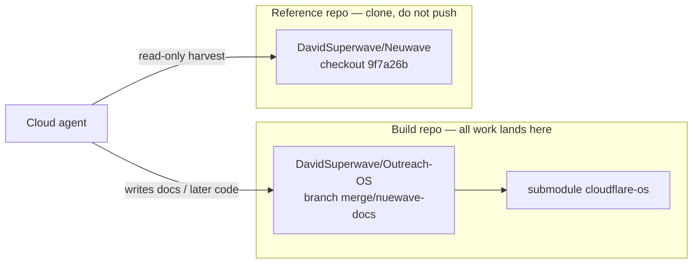
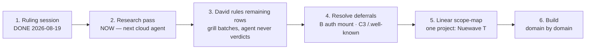

# Handoff map — what a cloud agent is walking into

> Written 2026-08-19 as a founder-facing picture of the merge state after
> the ruling session. This is orientation, not a second source of truth.
> The ledger, inventories, and dated "Ruled:" lines still win if anything
> here disagrees. Pair with `cloud-handoff.md` (the agent's entry point)
> and `next-agent-prompt.md` (the paste-ready kickoff).

**Interactive version:** open the Cursor canvas `nuewave-merge-handoff.canvas.tsx` beside this chat.

**Claude Code:** paste [`claude-code-kickoff.md`](./claude-code-kickoff.md) (the Prompt section) into a new session. Same job as `next-agent-prompt.md`, with the first-message two-repo setup spelled out.

---

## The situation in one paragraph

**Neuwave** (Rust/AWS, SolidJS, one Postgres) is being **fully absorbed**
into **Outreach-OS** (Cloudflare-native, `cloudflare-os` kernel). Every old
capability gets one verdict — rebuild CF-native or kill — recorded in
`merge-ledger.md`. Nothing keeps running on AWS. No live data migrates.
Schemas, endpoints, and UX are harvested from a **pinned, read-only clone**
of `DavidSuperwave/Neuwave`. That harvest source is **not** in this repo
and was **never pushed** anywhere as part of this work. A cloud agent must
clone it itself.

## The two files a cloud agent starts with

| File | Role | Paste / read |
|---|---|---|
| [`next-agent-prompt.md`](./next-agent-prompt.md) | Kickoff prompt. Paste it verbatim as the session opener. | **Paste** |
| [`cloud-handoff.md`](./cloud-handoff.md) | Fresh-environment brief. The prompt's first action is "read this, then do §1." | **Read first** |

Direct tree: [docs/plans/nuewave-native/merge on `merge/nuewave-docs`](https://github.com/DavidSuperwave/Outreach-OS/tree/merge/nuewave-docs/docs/plans/nuewave-native/merge)

## Environment reconstruction (cloud-handoff §1)

Do this **before** any research. Local Windows paths in older docs (`C:\Users\Kecin\Projects\...`) are irrelevant — only relative pointers matter.

| Step | What | Why |
|---|---|---|
| 1 | Clone `DavidSuperwave/Outreach-OS`, stay on `merge/nuewave-docs` | All merge docs and later code live here |
| 2 | `git submodule update --init cloudflare-os` | Kernel is the CF-native target (`[CF]` pointers) |
| 3 | Clone `DavidSuperwave/Neuwave` as a **sibling** directory named `Neuwave` | Harvest source. **Needs read access granted to the cloud agent** — this repo is under David's account |
| 4 | `git checkout 9f7a26bccb85e6f806a6e0c8d6c8e53f3a3541bf` | **The pin is law.** Every `[NW]` pointer resolves here. Never cite `main` or any movable branch |
| 5 | Read the §2 file order in `cloud-handoff.md` | Ledger + inventories + audits before filling rows |

Neuwave shape at the pin: `apps/` (SolidJS), `crates/` (hexagonal Rust; HTTP inbound usually `src/inbound/axum_router.rs`), `services/` (composition roots), `packages/`, `static_assets/schema.graphql`, `infra/`, `docker/`, `docs/`.

**Hard isolation:** nothing from Neuwave is copied into Outreach-OS git. Agents read it, write **pointers** (`path:line` @ `9f7a26b`) and CF-native proposals into this folder.

## Where we are in the pipeline

| Stage | Status |
|---|---|
| Foundation rulings + harvest rules | Done |
| Inventories (backend, frontend, schema) | First slice done — inherit coverage caveats, never regenerate |
| P1 audits (connectivity, CRM, mailbox) | Done |
| Pattern review D1–D4 | Ruled 1a / 2a / 3a / 4a |
| Route batches A–C | Ruled (B and C3 **deferred**, recorded as the ruling) |
| Batch E (contacts_service) | Ruled: keep as its own capability, in the pilot |
| Research remaining ☐ ledger rows | **This is the next agent's job** |
| Linear "Nuewave T" | Forbidden until every row is ✔ and David orders it |
| Build | Not yet |

## Ledger snapshot (101 rows)

Source: `merge-ledger.md` as of 2026-08-19. Lifecycle: `☐` unresearched → `◐` researched (verdict empty) → `✔` ruled by David.

| Status | Count | Meaning |
|---|---|---|
| ✔ ruled | **43** | Dated verdict in the ledger |
| ◐ researched | **32** | Pointers/proposal filled; still awaiting a ruling (or parked) |
| ☐ unresearched | **26** | Research columns empty — next pass fills these first |

| Ledger section | ✔ | ◐ | ☐ | n |
|---|---|---|---|---|
| DSS domains (`/dss`) | 8 | 0 | 10 | 18 |
| DCS domains (`/cognition`) | 3 | 1 | 6 | 10 |
| Standalone services | 9 | 1 | 10 | 20 |
| Frontend routes & splits | 7 | 12 | 0 | 19 |
| Block types | 4 | 9 | 0 | 13 |
| Invariants | 5 | 0 | 0 | 5 |
| Data model / patterns | 7 | 9 | 0 | 16 |

Default for anything not explicitly killed: **KEEP — faithful recreation**. Kills so far: `graphql_soup`, FusionAuth, the AWS substrate, Cloudflare Access as the auth model, and the `coding-agent-worker` lift (no source ever existed). Business chrome (billing / onboarding / getting-started) is **parked-prepare**.

## Highest-leverage research (do these first)

The kickoff prompt orders these six before the long tail:

1. **documents** — versions, annotations, blocks; cross-check `schema-harvest.md` + frontend block types
2. **projects** — folders/containers (`Project = Folder` is a preserved invariant)
3. **properties** — EAV domain *surface* (D2/2a already fixed storage direction)
4. **search_service + search_processing_service**
5. **connection_gateway internals** — already superseded by kernel `/api` session push (C1); still enumerate event types so kernel session events can be designed
6. **Lambda/batch families** — ~20 handlers, never extracted; the known inventory hole (`infra/`, deploy configs, queue consumers)

Then, as time allows: favorites, foreign_entity, webhook, bots, github, DSS-native chrome, memory, import, onboarding, ai_usage, ai_projections, streaming/completions, notification_service, static_file_service, unfurl_service, image_proxy_service, scheduled_action, convert_service, analytics-proxy, future coding-agent row, remaining frontend ◐, block types, table groups.

**Definition of done for the research pass:** those six rows fully researched (ledger columns + audits where warranted); coverage stated on every output; a roadmap Status-log entry; a closing restatement of remaining ☐/◐ rows plus the two standing deferrals (B, C3).

## Ruled batches (A–E) — do not re-argue

| Batch | Verdict |
|---|---|
| **D1** entity glue | **1a** — keep `Entity=(type,id)` ontology; storage = DOs/typed-storage + entity registry + **required** materialized-index layer |
| **D2** properties | **2a** — keep semantics exactly; values on the entity record; filter-index layer is first-class |
| **D3** outbox | **3a** — discipline not tables: intent record + alarm in-DO; idempotent consumers; poison-pill mark-and-skip |
| **D4** leases | **4a** — DO single-writer + alarms; no ported claims/dispatchers |
| **A1** surface | **R3 hybrid** — RPC-first via `/api`; tiny explicit HTTP surface only where physics requires it |
| **A2** mounts | **L1** — router strips lifted prefixes; services stay byte-for-byte (`/sync` `/lexical` `/ai-editing`) |
| **A3** lift set | **Three services** (sync, lexical, ai-editing). coding-agent-worker **dropped** — never committed, never a CF Worker |
| **B** auth mount | **Deferred** to auth design time; `/auth/*` stays reserved |
| **C1** live push | connection_gateway **superseded** by kernel `/api` session push |
| **C2** webhooks | `/hooks/<source>/*` unified ingress |
| **C3** well-known | **Deferred** to native-app-links / first-party-MCP-host rows |
| **E** contacts_service | **Keep as its own capability, in the pilot** — user↔user graph, not CRM |

## What the agent is allowed to do — and not

| Do | Do not |
|---|---|
| Fill ledger **research** columns (pointers, what it does, CF target, effort) | Write a `Verdict:` |
| Deep-audit into `merge/audits/` when a row warrants it (documents, Lambdas almost certainly) | Simulate rulings if David is absent — leave rows ◐ |
| Present grill-style options when David is present | Re-argue D1–D4, A1–A3, C1–C2, E |
| Commit **doc updates** on `merge/nuewave-docs` (David's 2026-08-19 order) | Commit anything else without an explicit order |
| Pin every pointer `path:line` against `Neuwave@9f7a26b` | Cite a movable branch; copy Rust; use Macro branding |
| State coverage on every output | Regenerate or delete the ledger / inventories; write Linear |

Two tripwires: **no Macro branding**, **no Rust code reuse** (the three lifted CF services excepted; *reading* Rust as reference is required).

## Read order after environment setup

1. `merge/README.md` — eight base rulings, pin, folder map
2. `merge/agent-brief.md` — binding rules + Linear scope-map contract
3. `merge/merge-ledger.md` — ledger of record
4. `merge/pattern-review.md` — four data patterns, all ruled
5. `merge/route-reconciliation.md` — unified route map, batches A–C
6. `merge/audits/` — connectivity, CRM, mailbox
7. `merge/business-chrome-primitives.md` — parked-prepare reference
8. inventories + `schema-harvest.md` — never regenerate
9. `../MISSION.md`, `../roadmap.md` §Status log

## Launch checklist for a cloud agent

- [ ] Cloud agent has **read access** to `DavidSuperwave/Neuwave` (private; clone will fail without it)
- [ ] Workspace is `DavidSuperwave/Outreach-OS` on `merge/nuewave-docs`
- [ ] Paste `next-agent-prompt.md` as the opening message
- [ ] Confirm the agent read `cloud-handoff.md` and reconstructed env (§1) **before** filling rows
- [ ] Confirm Neuwave is at `9f7a26bccb85e6f806a6e0c8d6c8e53f3a3541bf`, sibling dir, **no push**
- [ ] Confirm the agent will not write Linear, will not invent verdicts, and will not regenerate inventories
