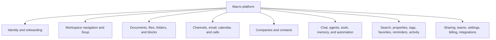
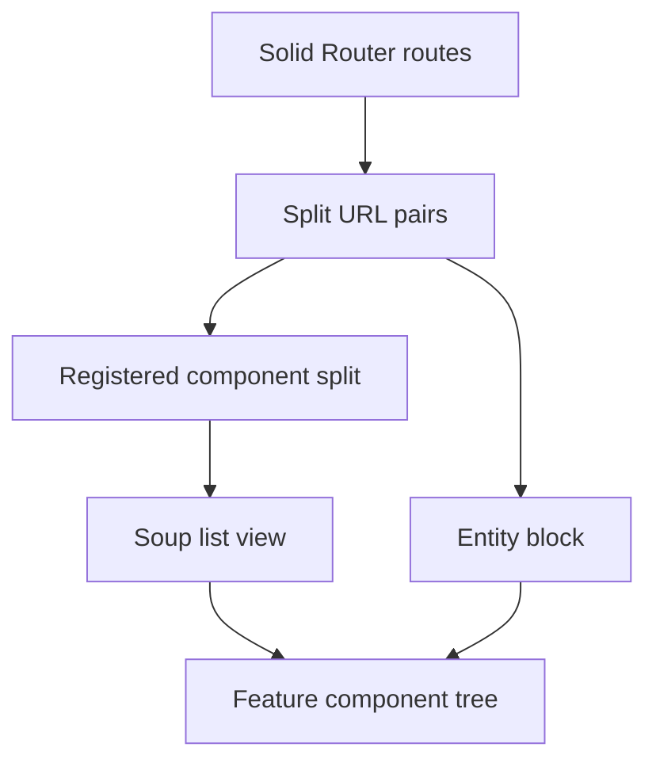
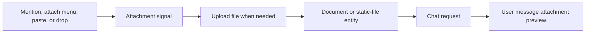
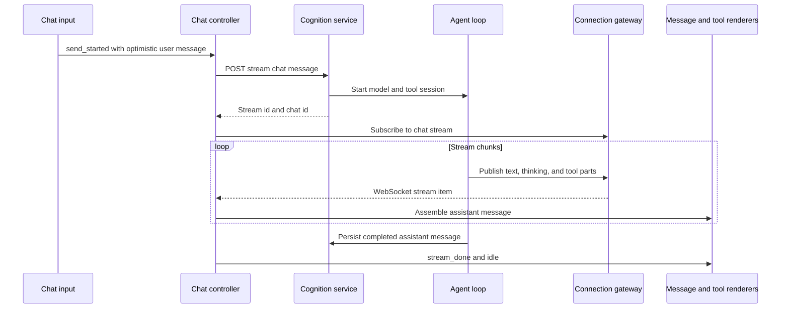

# Platform feature map

> Last verified: 2026-08-19
> Scope: current product features, UI trees, routes/splits, client boundaries,
> service ownership, domain crates, and primary infrastructure
> Architecture companion: [platform canvas](./platform-canvas.md)

This map answers four questions for each product area:

1. What can the user do?
2. Which route, split, and component tree renders it?
3. Which frontend query/client boundary carries the data?
4. Which deployable, Rust domain, and store owns the behavior?

## Feature map at a glance



| Feature domain | Primary frontend root | Primary runtime owner | Primary stores/infrastructure |
|---|---|---|---|
| Authentication/account | [`features/auth`](../../../apps/web/src/features/auth/) | Authentication service | FusionAuth, MacroDB, Redis |
| Onboarding/getting started | [`features/setup`](../../../apps/web/src/features/setup/), [`features/onboarding`](../../../apps/web/src/features/onboarding/) | Auth, DCS onboarding/import, DSS starter docs | MacroDB, email/Gmail integrations |
| Workspace/Soup | [`features/next-soup`](../../../apps/web/src/features/next-soup/) | Soup and GraphQL domains mounted in DSS | MacroDB, CommsDB, EmailDB, Kafka |
| Documents/files/folders | `block-md`, `block-pdf`, `block-code`, `block-canvas`, `block-project` | Documents/projects domains in DSS; sync-service | MacroDB, S3, Cloudflare Durable Objects |
| Search | Search Soup view and command menu | Search query domain in DSS; search-processing deployable | OpenSearch, SQS, Kafka |
| Channels | [`features/channel`](../../../apps/web/src/features/channel/) | Channels domain mounted in DSS; connection gateway | CommsDB, DynamoDB, Kafka/SQS |
| Email/calendar | [`block-email`](../../../apps/web/src/features/block-email/), [`features/calendar`](../../../apps/web/src/features/calendar/) | Email service for watch/mutations; calendar-event query domain in DSS | EmailDB, MacroDB, S3, Google APIs |
| Calls | [`features/channel/Call`](../../../apps/web/src/features/channel/Call/), [`block-call`](../../../apps/web/src/features/block-call/) | Call domain mounted in DSS | MacroDB, LiveKit, S3, Kafka |
| CRM | [`features/companies`](../../../apps/web/src/features/companies/), company/contact blocks | CRM domain mounted in DSS; contacts service | MacroDB, EmailDB-derived data |
| Chat/agents | [`block-chat`](../../../apps/web/src/features/block-chat/), shared AI UI | DCS, chat/agent/ai_tools crates, connection gateway | MacroDB, Redis streams, S3 |
| Automation | [`block-automation`](../../../apps/web/src/features/block-automation/) | Scheduled-action deployable and agent loop | MacroDB, scheduler runtime |
| Notifications | [`features/notifications`](../../../apps/web/src/features/notifications/) | Notification service plus connection gateway | NotificationDB, SQS, push providers |
| Properties/tags | [`features/property`](../../../apps/web/src/features/property/) | Properties domain mounted in DSS | MacroDB |
| Sharing/permissions | [`features/sharing`](../../../apps/web/src/features/sharing/) | DSS entity access, auth permissions | MacroDB |
| Teams/billing | Settings, invitations, paywall | Authentication service; teams domain; Stripe webhooks | MacroDB, FusionAuth, Stripe |
| Integrations | Settings, PR block, import, MCP | Auth, DSS GitHub/foreign-entity, email, DCS MCP/import | External APIs, MacroDB |

## Routes and view surfaces

### Routing model

The app has two routing layers:



- Web base: `/app`
- Tauri base: `/`
- Default authenticated split:
  [`/component/inbox`](../../../apps/web/src/lib/constants/defaultRoute.ts)
- Canonical split encoding: alternating `{type}/{id}` segments
- Router:
  [`routes/Root.tsx`](../../../apps/web/src/routes/Root.tsx)
- Split route:
  [`SplitLayoutRoute.tsx`](../../../apps/web/src/components/app/split-layout/SplitLayoutRoute.tsx)
- Decode/alias behavior:
  [`layoutUtils.ts`](../../../apps/web/src/components/app/split-layout/layoutUtils.ts)

### Top-level routes

These entries are declared directly in `Root.tsx`.

Important: the single-segment workspace entries reuse `LayoutRoute` but do not
provide a complete `{type}/{id}` split pair. On a direct load, current
`decodePairs` behavior falls back to `component/inbox`. They are declarations,
not reliable deep links to the named views. Use `/component/<view-id>` for
direct navigation; sidebar/mobile actions open those component splits
imperatively. `/inbox` appears correct because inbox is the fallback.

| Route | Surface | Primary component | Notes |
|---|---|---|---|
| `/*splits` | Main workspace | `SplitLayoutContainer` | Canonical split route |
| `/inbox` | Declared single-segment workspace path | Split route component | Falls back to the intended `component/inbox` |
| `/activity` | Declared single-segment workspace path | Split route component | Direct load falls back to inbox; canonical split is `component/activity` |
| `/reminders` | Declared single-segment workspace path | Split route component | Direct load falls back to inbox; canonical split is `component/reminders` |
| `/calendar` | Declared single-segment workspace path | Split route component | Direct load falls back to inbox; canonical split is `component/calendar` |
| `/agents` | Declared single-segment workspace path | Split route component | Direct load falls back to inbox; canonical split is `component/agents` |
| `/mail` | Declared single-segment workspace path | Split route component | Direct load falls back to inbox; canonical split is `component/mail` |
| `/documents` | Declared single-segment workspace path | Split route component | Direct load falls back to inbox; canonical split is `component/documents` |
| `/tasks` | Declared single-segment workspace path | Split route component | Direct load falls back to inbox; canonical split is `component/tasks` |
| `/channels` | Declared single-segment workspace path | Split route component | Direct load falls back to inbox; canonical split is `component/channels` |
| `/calls` | Declared single-segment workspace path | Split route component | Direct load falls back to inbox; canonical split is `component/calls` |
| `/companies` | Declared single-segment workspace path | Split route component | Direct load falls back to inbox; canonical split is `component/companies` |
| `/files` | Declared single-segment workspace path | Split route component | No `files` component ID; direct load falls back to inbox |
| `/` | Auth gate and redirect | `BasePathComponent` | Authenticated users enter workspace |
| `/login`, `/signup` | Authentication | `Login` | Passwordless/SSO |
| `/welcome` | Welcome | `MobileAuthWelcome` or `Login` | Native-specific |
| `/onboarding` | Onboarding | `MobileOnboarding` or `OnboardingFlow` | Desktop flow gated |
| `/setup` | Legacy onboarding path | `SetupRoute` | Redirects when onboarding v4 is enabled |
| `/mobile-email-signup` | Mobile web capture | `MobileWebSignup` | Marketing handoff |
| `/team-invite` | Team invitation | `TeamInviteAcceptance` | Query carries invite identity |
| `/channel-invite` | Channel invitation | `ChannelInviteAcceptance` | Query carries join code |
| `/task-slug/:taskSlug` | Task deep link | `TaskRoute` | Redirects to `/task/{documentId}`; alias resolves to the `md` block |
| `/email-signup-callback` | Auth callback | `EmailCallback` | Generated by `makeEmailAuthComponents` |
| `/inbox-link-callback` | Gmail linking callback | `EmailLinkCallback` | Generated by `makeEmailAuthComponents` |
| `/login/popup/success` | OAuth popup completion | Inline component | Broadcasts login success and closes |
| `*404` | Not found | `NotFound` | Native redirects; web returns to origin |

`LIST_VIEW_PATHS` also declares `/search` and `/folders`, but `Root.tsx` does
not declare those top-level entries. Treat `component/search` and
`component/folders` as the confirmed surfaces until route behavior is changed
or tested.

### Registered production component splits

Source:
[`componentRegistry.tsx`](../../../apps/web/src/components/app/split-layout/componentRegistry.tsx).

| Component ID | Surface | Root component | Availability |
|---|---|---|---|
| `home` | Home/AI landing | `Home` | `enable-home-view` plus development override |
| `getting-started` | First-run hub | `GettingStarted` | Authenticated |
| `inbox` | Unified inbox | `SoupView` | Active |
| `activity` | Activity feed | `ActivityView` | `ENABLE_ACTIVITY`; otherwise redirects |
| `reminders` | Reminder lists | `SoupView` | `enable-reminders`; otherwise redirects |
| `calendar` | Calendar | `CalendarView` | `enable-calendar-ui`; otherwise redirects |
| `agents` | Chats, automations, skills | `SoupView` plus automation entities | Active |
| `mail` | Email lists | `SoupView` | Active |
| `documents` | Files/documents | `SoupView` | Active |
| `tasks` | Task lists/grid | `SoupView` | Active |
| `channels` | Channel lists | `SoupView` | Active |
| `calls` | Call lists | `SoupView` | Active; call details gated |
| `companies` | CRM companies | `SoupView` | `enable-crm`; otherwise redirects |
| `folders` | Folder lists | `SoupView` | Active split ID |
| `search` | Unified search | `SoupView` | Active split ID |
| `settings` | Settings panel | `SettingsPanelComponentWrapper` | Tabs gated individually |
| `channel-compose` | New channel | `ChannelCompose` | Active |
| `email-compose` | New email | `EmailCompose` | Active; accepts `?to=` |
| `task-compose` | New task | `ComposeTask` | Active |
| `skill-compose` | New skill | `ComposeSkill` | Active |
| `import-linear` | Linear import | Lazy `ImportLinear` | Integration-dependent |
| `preview-empty` | Preview-pair placeholder | `EmptyStatePanel` | Internal workspace state |
| `non-member-channel` | Joinable channel preview | `NonMemberChannelPreview` | Parameter-driven |
| `loading` | Loading placeholder | `LoadingBlock` | Internal workspace state |
| `icon-gallery` | Internal product icon gallery | `IconGallery` | Registered outside local-only guards, but not a product feature |
| `unified-list` | Legacy list ID | Redirect | Redirects to inbox |
| `firehose`, `my-activity` | Legacy activity IDs | Redirect | Redirect to activity |

Local/dev-only component splits are inventoried in
[UI/UX debug galleries](./ui-ux-component-catalog.md#debug-galleries-and-live-audit-surfaces).

### List views and tabs

Sources:
[`list-views.ts`](../../../apps/web/src/lib/constants/list-views.ts) and
[`soup-filter-presets.ts`](../../../apps/web/src/features/next-soup/sidebar/soup-filter-presets.ts).

| View | Default tab | Other tabs | Entity focus |
|---|---|---|---|
| Inbox | `signal` | `noise`, `all` | Mixed cross-entity feed |
| Agents | `owned` | `running`, `shared`, `automations`, `skills` | Chats, automations, skill docs |
| Mail | `important` | `noise`, `calendar`, `drafts`, `sent`, `shared`, `all` | Email threads/drafts |
| Documents | `owned` | `shared`, `attachments`, `folders`, `all` | Non-task documents/files |
| Tasks | `assigned-to-me` | `created-by-me`, `all` | Task-subtype Markdown docs |
| Channels | `recent` | `people`, `teams` | Channels and direct messages |
| Calls | `all` | `missed`, `unattended` | Call records |
| Companies | `active` | `hidden` for admins | CRM companies |
| Folders | `owned` | `all` | Projects/folders |
| Reminders | `active` | `scheduled`, `done` | Reminder entities |
| Search | `all` | — | Search-supported Soup entities |

### Block surfaces

Sources:
[`BlockRegistry`](../../../apps/web/src/lib/core/block.ts) and
[`allBlocks.ts`](../../../apps/web/src/lib/core/constant/allBlocks.ts).

| Split type | Implementation | Aliases/notes |
|---|---|---|
| `md` | [`features/block-md`](../../../apps/web/src/features/block-md/) | `task`, `snippet`, `skill` |
| `pdf` | [`features/block-pdf`](../../../apps/web/src/features/block-pdf/) | `write` virtual type resolves here when enabled |
| `code` | [`features/block-code`](../../../apps/web/src/features/block-code/) | `csv` |
| `canvas` | [`features/block-canvas`](../../../apps/web/src/features/block-canvas/) | Macro whiteboard document |
| `image` | [`features/block-image`](../../../apps/web/src/features/block-image/) | Image file |
| `video` | [`features/block-video`](../../../apps/web/src/features/block-video/) | Video file |
| `chat` | [`features/block-chat`](../../../apps/web/src/features/block-chat/) | AI conversation |
| `channel` | [`features/block-channel`](../../../apps/web/src/features/block-channel/) | Adapter into channel feature |
| `email` | [`features/block-email`](../../../apps/web/src/features/block-email/) | Email thread |
| `call` | [`features/block-call`](../../../apps/web/src/features/block-call/) | Call record/transcript |
| `project` | [`features/block-project`](../../../apps/web/src/features/block-project/) | Folder/project |
| `automation` | [`features/block-automation`](../../../apps/web/src/features/block-automation/) | Scheduled agent |
| `company` | [`features/block-company`](../../../apps/web/src/features/block-company/) | CRM company |
| `contact` | [`features/block-contact`](../../../apps/web/src/features/block-contact/) | CRM contact |
| `pr` | [`features/block-pr`](../../../apps/web/src/features/block-pr/) | GitHub pull request |
| `unknown` | [`features/block-unknown`](../../../apps/web/src/features/block-unknown/) | Fallback |

## Authentication, onboarding, teams, and billing

### User capabilities

- Sign in or sign up through passwordless email and supported SSO.
- Complete OAuth callbacks and link an inbox.
- Complete desktop or native onboarding.
- Join a team or channel by invite.
- Manage account, team, billing, and plan.
- Reauthenticate Gmail, GitHub, or calendar permissions.

### Frontend tree

```text
routes/Root.tsx
├── features/auth/Login.tsx
│   ├── EmailForm
│   ├── OTP/passwordless state
│   └── SSO hooks
├── features/auth/EmailAuth.tsx
├── features/auth/mobile-onboarding/
├── features/setup/flow/OnboardingFlow.tsx
│   ├── EmailStep
│   ├── ConnectorStep
│   ├── TeamStep
│   ├── PlanStep
│   ├── BuildingStep
│   └── SummaryStep
├── features/onboarding/InteractiveOnboardingModal.tsx
├── features/getting-started/getting-started.tsx
├── features/team-invitations/
├── features/channel-invitations/
└── features/paywall/
```

| Layer | Ownership |
|---|---|
| Queries | [`lib/queries/auth`](../../../apps/web/src/lib/queries/auth/), team/billing/onboarding query modules |
| Clients | [`service-auth`](../../../apps/web/src/lib/service-clients/service-auth/), storage/cognition clients for starter docs/import |
| Deployable | [`authentication_service`](../../../services/authentication_service/) |
| Mounted domains | [`crates/teams`](../../../crates/teams/), [`crates/referral`](../../../crates/referral/), native-app routes |
| Related services | DCS onboarding/import; DSS starter-document initialization; email service for inbox linking |
| Stores/external | MacroDB, FusionAuth, Stripe, Redis, Gmail/Google OAuth |

Important gates:

- `enable-onboarding-v4`: desktop full-screen onboarding.
- native mobile always uses its mobile onboarding path at `/onboarding`.
- paywall/plan presentation also depends on pricing flags and license state.

## Workspace, Soup, search, and command surfaces

### User capabilities

- Navigate cross-entity lists from the sidebar.
- Switch tabs, filter, group, sort, select, and bulk-act on entities.
- Preview entities in a linked split.
- Search across supported entity types.
- Open or create content from the command menu and launcher.
- Ask AI from Soup/search surfaces.

### Component tree

```text
components/app/Layout.tsx
├── app-sidebar/sidebar.tsx
├── features/command/CommandMenu.tsx
├── features/command/Launcher.tsx
├── mobile/MobileDock.tsx
└── split-layout/SplitLayout.tsx
    └── componentRegistry → SoupView
        ├── soup-view-context
        ├── soup-view-tabs
        ├── filters-bar/
        │   ├── search
        │   ├── sort
        │   ├── group
        │   ├── tags/properties
        │   └── mobile filter drawer
        ├── selection toolbar and action menus
        ├── views/inbox/
        ├── views/tasks/
        ├── views/companies/
        └── Entity.ListEntity → per-entity layouts
```

| Layer | Ownership |
|---|---|
| Feature root | [`features/next-soup`](../../../apps/web/src/features/next-soup/) |
| Presets | [`soup-filter-presets.ts`](../../../apps/web/src/features/next-soup/sidebar/soup-filter-presets.ts) |
| Queries | [`lib/queries/soup`](../../../apps/web/src/lib/queries/soup/), search query modules |
| Clients | `service-storage`, `service-search`, GraphQL Soup client, connection WebSocket |
| API owner | [`crates/soup`](../../../crates/soup/) and [`crates/graphql_soup`](../../../crates/graphql_soup/) mounted in DSS |
| Search owner | [`crates/search_service`](../../../crates/search_service/) mounted in DSS |
| Indexing | [`search_processing_service`](../../../services/search_processing_service/) |
| Stores/events | MacroDB, CommsDB, EmailDB, OpenSearch, Kafka, SQS |

Key flags include GraphQL Soup transport/cache, Soup filter persistence, new
Inbox layout, reminders, CRM, supported foreign entities, grouping, and unified
list AI input. The source of truth is
[`featureFlags.ts`](../../../apps/web/src/lib/core/constant/featureFlags.ts).

## Documents, files, folders, and editors

### User capabilities

- Create and edit Markdown docs, tasks, snippets, and agent skills.
- View/edit supported code and CSV files.
- View and annotate PDFs and converted DOCX content.
- Create and navigate canvas documents.
- View images and video.
- Organize entities into folders/projects.
- Upload, extract, convert, share, mention, and search content.
- Collaborate in realtime and recover history.

### Component tree

```text
Soup documents/tasks/folders row
└── split open {block type, entity id}
    └── BlockOrchestrator
        └── BlockLoader
            ├── block-md
            │   └── LexicalMarkdown editor, notebook, format tools,
            │       outline, discussion, properties, history
            ├── block-pdf
            │   └── PDF viewer, tabs, markup, search, placeables
            ├── block-code
            │   └── CodeMirror and preview
            ├── block-canvas
            │   └── Canvas renderer, nodes, toolbar, selection
            ├── block-image / block-video
            └── block-project
                └── Folder/project view and create menu
```

| Layer | Ownership |
|---|---|
| Block definitions | [`features/block-*/definition.ts`](../../../apps/web/src/features/) |
| Shared editor | [`LexicalMarkdown`](../../../apps/web/src/lib/core/component/LexicalMarkdown/) |
| Queries | Storage/document/project/history/annotation modules under [`lib/queries`](../../../apps/web/src/lib/queries/) |
| Clients | `service-storage`, `service-static-files`, `service-sync`, AI editing worker client |
| API owners | [`crates/documents`](../../../crates/documents/), [`crates/projects`](../../../crates/projects/) mounted in DSS |
| Collaboration | [`services/sync-service`](../../../services/sync-service/), [`packages/collaboration`](../../../packages/collaboration/) |
| Text export | [`services/lexical-service`](../../../services/lexical-service/) |
| AI edits | [`services/ai-editing-worker`](../../../services/ai-editing-worker/) |
| Ingestion | Text extractor, DOCX unzip, upload extractor/finalizer, convert service |
| Stores | MacroDB, S3, DynamoDB, Redis, Cloudflare Durable Objects, OpenSearch |

Notable feature flags cover PDF tabs/markup/autosave/multisplit, DOCX conversion,
canvas media/file/text import, video blocks, Markdown collaboration/history,
snippets, comments, mentions, references, Git blame, and inline AI editing.

## Email, inbox, and calendar

### User capabilities

- Connect and synchronize Gmail inboxes.
- Browse important/noise/calendar/draft/sent/shared/all tabs.
- Read threads and attachments.
- Compose, reply, schedule, share, and forward email.
- Manage labels, filters, signatures, and connected inbox settings.
- View and edit calendar events after elevated Google consent.

### Component tree

```text
component/mail → SoupView
├── mail tab/filter presets
└── email row → split email/<thread-id>
    └── block-email
        ├── thread/message list
        ├── message container and attachments
        ├── reply/compose input
        ├── top bar
        └── mobile compose drawer

component/calendar
└── features/calendar/calendar-view.tsx
    ├── CalendarPage
    ├── period/month controls
    ├── event editor dialog
    └── calendar side-panel sections
```

Compose can also open as `component/email-compose`; `mailto:` handoff accepts a
`to` query parameter.

| Layer | Ownership |
|---|---|
| UI | [`features/block-email`](../../../apps/web/src/features/block-email/), [`features/inbox`](../../../apps/web/src/features/inbox/), [`features/calendar`](../../../apps/web/src/features/calendar/) |
| Queries | Email and calendar modules under [`lib/queries`](../../../apps/web/src/lib/queries/) |
| Clients | `service-email`, `service-storage`, `service-static-files`, `service-image-proxy` URL |
| Deployable | [`email_service`](../../../services/email_service/) and its pubsub workers |
| Shared domain | [`crates/email`](../../../crates/email/) |
| Calendar APIs | Email service owns watch/mutations; [`crates/calendar_events`](../../../crates/calendar_events/) mounted in DSS owns occurrence queries |
| Workers | Scheduled send, token refresh, suppression, attachment/static-file cleanup |
| Stores/external | EmailDB, MacroDB linkage, S3, SQS, Gmail and Google Calendar APIs |

Important gates include email globally, signatures, scheduled send, email
sharing, calendar UI, platform-specific calendar prompts, and image proxying.

## Channels, messages, and calls

### User capabilities

- Browse recent, people, and team channels.
- Join visible team channels.
- Create channels and accept invite links.
- Send, edit, reply, react, mention, attach, forward, and thread messages.
- Start/join calls and see active/incoming call state.
- View call recordings and transcripts.
- Interact with channel bots and agent mentions.

### Component tree

```text
component/channels → SoupView
└── channel row
    ├── component/non-member-channel → Join
    └── split channel/<channel-id>
        └── block-channel adapter
            └── features/channel
                ├── Channel/
                ├── Message/
                │   ├── Message.Root/Layout/Slot
                │   ├── content, sender, timestamp
                │   ├── attachments and reactions
                │   └── hover/mobile actions
                ├── Thread/
                ├── Input/
                ├── Participants/
                ├── Attachments/
                ├── Mobile/
                └── Call/
                    ├── CallContext
                    ├── InCallPanel
                    └── call controls
```

| Layer | Ownership |
|---|---|
| UI | [`features/channel`](../../../apps/web/src/features/channel/), [`block-channel`](../../../apps/web/src/features/block-channel/), [`block-call`](../../../apps/web/src/features/block-call/) |
| Queries | Channel and call modules under [`lib/queries`](../../../apps/web/src/lib/queries/) |
| Clients | `service-storage`, `service-call`, `service-connection` |
| Channel API | [`crates/channels`](../../../crates/channels/) mounted in DSS |
| Call API | [`crates/call`](../../../crates/call/) mounted in DSS |
| Realtime | [`connection_gateway`](../../../services/connection_gateway/) |
| Bots | [`crates/bots`](../../../crates/bots/), [`crates/channel_bots`](../../../crates/channel_bots/) |
| Stores/external | CommsDB, MacroDB call records, DynamoDB connections, LiveKit, S3 recordings, Kafka |

Calls and bot management are PostHog/env gated in production. Channel behavior
also has flags for CallKit, unified input, static document cards, and channel
attachments in AI.

## CRM and contacts

### User capabilities

- Browse active and hidden companies in list/grid/kanban forms.
- Open company and contact blocks.
- Create companies and contacts.
- Edit CRM properties/stages and save/share view state.
- Link email-derived context and use CRM entities in search and AI tools.

### Component tree

```text
component/companies → SoupView
├── CompanyListEntity
├── CompanyKanban / grid
├── CompanyViewsMenu
└── company row
    ├── split company/<id> → block-company → companies/Company/
    └── split contact/<id> → block-contact → contacts/Contact/

Global modals
├── CreateCompanyModal
└── CreateContactModal
```

| Layer | Ownership |
|---|---|
| UI | [`features/companies`](../../../apps/web/src/features/companies/), [`features/contacts`](../../../apps/web/src/features/contacts/), company/contact blocks |
| Queries | CRM and Soup modules under [`lib/queries`](../../../apps/web/src/lib/queries/) |
| Clients | `service-storage`, `service-contacts`, `service-search` |
| API owner | [`crates/crm`](../../../crates/crm/) mounted in DSS |
| Contact graph | [`contacts_service`](../../../services/contacts_service/) and [`crates/contacts`](../../../crates/contacts/) |
| Search | Search domain and search-processing index |
| Stores | MacroDB; EmailDB as an enrichment source |

All frontend CRM surfaces are intended to share the `enable-crm` gate. The
hidden-companies tab additionally requires team admin/owner context.

## Properties, tags, favorites, sharing, reminders, and activity

### Component relationships

```text
Entity display
├── Entity.* extractors and list layouts
├── Property.* display/edit composition
│   ├── inline editors
│   ├── popover editors
│   ├── selectors
│   └── tags
├── favorites/sidebar
├── sharing/global-share-modal
├── entity/bulk-edit and entity-modal
├── reminders/ReminderComposerModal
└── activity-timeline
```

| Feature | UI entry | API owner | Store/events |
|---|---|---|---|
| Properties/tags | [`features/property`](../../../apps/web/src/features/property/) | [`crates/properties`](../../../crates/properties/) mounted in DSS | MacroDB |
| Favorites | [`features/favorites`](../../../apps/web/src/features/favorites/) | [`crates/favorites`](../../../crates/favorites/) mounted in DSS | MacroDB |
| Pins/recents | Sidebar/home consumers | DSS-native `/pins` and `/recents` modules | MacroDB |
| Sharing/access | [`features/sharing`](../../../apps/web/src/features/sharing/), core permission components | DSS entity-access APIs and auth permissions | MacroDB |
| Reminders | [`features/reminders`](../../../apps/web/src/features/reminders/) and Soup view | [`crates/reminders`](../../../crates/reminders/) mounted in DSS | MacroDB, SQS |
| Activity | [`features/activity-timeline`](../../../apps/web/src/features/activity-timeline/) | DSS-native activity routes | MacroDB/event sources |

Important gates include create-property, property display/sort/filter, tag team
sharing, reminders, activity, and document mention notifications.

## Notifications

### User capabilities

- Grant browser/native notification permission.
- Receive platform and in-app updates.
- Navigate from a notification to its entity/split.
- Mark entity notifications read while viewing.
- Configure notification preferences and mute entities.

### Component and data flow

```text
Root.tsx
├── BrowserNotificationModal
├── createNotificationSource(connectionGatewayWebsocket)
├── useNotificationUpdates
└── PendingNotificationNavigationEffect

Entity blocks/messages
├── MarkMessageNotifications
└── DebouncedNotificationReadMarker
```

| Layer | Ownership |
|---|---|
| UI/runtime | [`features/notifications`](../../../apps/web/src/features/notifications/) |
| Queries | Notification modules under [`lib/queries`](../../../apps/web/src/lib/queries/) |
| Clients | `service-notification`, `service-connection`, some DSS mute/settings operations |
| Deployable/domain | [`notification_service`](../../../services/notification_service/) and [`crates/notification`](../../../crates/notification/) |
| Realtime | Connection gateway |
| Stores/providers | NotificationDB, SQS, browser/native push providers |

## Settings and integrations

Settings is a component split with a special URL form:

```text
/settings/account
/settings/billing
/settings/appearance
/settings/team
/settings/tags
/settings/connections
/settings/mcp-server
```

These are split URL segments handled by the `/*splits` route and translated to
internal `component/settings` content. `Root.tsx` does not declare a separate
`/settings/:slug` route.

Configuration source:
[`settingsTabsConfig.tsx`](../../../apps/web/src/lib/core/constant/settingsTabsConfig.tsx).

| Group | Tab/slug | UI panel | Gate |
|---|---|---|---|
| General | Account / `account` | `settings/Account.tsx` | Always |
| General | Billing / `billing` | `settings/Billing.tsx` | Always |
| General | Appearance / `appearance` | `settings/Appearance.tsx` | Always |
| General | Mobile App / `mobile-app` | `settings/MobileApp.tsx` | QR flag; hidden on native |
| General | Shortcuts / `shortcuts` | `settings/Shortcuts.tsx` | Hidden on touch |
| Workspace | Team / `team` | `settings/Team.tsx` | Always |
| Workspace | Tags / `tags` | `settings/Tags.tsx` | Always |
| Workspace | CRM / `crm` | `settings/Crm.tsx` | CRM flag |
| Workspace | Connections / `connections` | `settings/ConnectedAccounts.tsx` | Always |
| Workspace | MCP server / `mcp-server` | `settings/Agent.tsx` | Hidden on native |
| Workspace | Bots / `bots` | `settings/Bots.tsx` | Bot-management flag |
| Admin | Debug / `admin` | `settings/Admin.tsx` | Admin permission |

Related integration surfaces:

| Integration | UI | Runtime owner |
|---|---|---|
| Gmail/Calendar | Connected accounts, inbox dialogs, auth prompts | Email service and auth OAuth |
| GitHub | Settings, PR block, search/foreign entities | GitHub and foreign-entity domains mounted in DSS |
| Linear import | `component/import-linear` | DCS import and MCP/integration paths |
| Macro MCP server | Settings MCP setup cards | Standalone MCP service/auth proxy |
| Outbound MCP connections | Connected accounts and agent tool calls | DCS `mcp_client` domain |
| Stripe | Paywall and billing settings | Authentication webhooks and Stripe client |
| cal.com | Calendar/webhook behavior | `cal` domain mounted in DSS |

## Chat and agents

Macro AI chat is an entity block split (`{ type: 'chat', id }`), not a
standalone page route. Shared chat UI lives under
[`lib/core/component/AI`](../../../apps/web/src/lib/core/component/AI/);
the entity block lives under
[`features/block-chat`](../../../apps/web/src/features/block-chat/).

### Feature tree

```text
Chat and agents
├── Entry surfaces
│   ├── Home composer
│   ├── Home example prefixes
│   ├── AI-generated home recommendations
│   ├── SoupChatInput
│   ├── Search "Ask AI"
│   ├── Getting-started examples
│   ├── ChatWithAgentButton on entity surfaces
│   ├── Command menu actions
│   └── Recent sessions / empty-chat tips
├── Chat block
│   ├── Top bar and sharing
│   ├── Message timeline
│   ├── User message edit/resend
│   ├── Assistant text/thinking/activity
│   ├── Tool call and tool response UI
│   ├── Composer and model selector
│   ├── Attachments and mentions
│   ├── Stop/reconnect/background send
│   └── Details/properties side panel
├── Agent tools
│   ├── Search/read/write domain tools
│   ├── Web search and fetch
│   ├── Email compose with human approval
│   ├── DisplayResults dynamic UI
│   ├── MCP tool calls
│   └── Subagent
├── Agent contexts
│   ├── Open tabs
│   ├── Attached entities/files
│   ├── User and product instructions
│   └── Unified memory
└── Secondary consumers
    ├── Channel bots
    ├── Scheduled actions
    ├── Home AI projections
    ├── External Macro MCP clients
    └── AI document editing
```

### Entry surfaces and suggestions

All new-chat surfaces either open a chat split directly or pass a pending send
through
[`signal/pendingSend.ts`](../../../apps/web/src/lib/core/component/AI/signal/pendingSend.ts).

| Surface | Source | Behavior |
|---|---|---|
| Home composer | [`features/home/home.tsx`](../../../apps/web/src/features/home/home.tsx) | Creates chat, stores pending message, opens split; supports background send |
| Home examples | [`home-examples.tsx`](../../../apps/web/src/features/home/home-examples.tsx) | Inserts static prompt prefixes for the user to complete |
| Home recommendations | [`home-hub.tsx`](../../../apps/web/src/features/home/home-hub.tsx), [`createHomeRecommendations.ts`](../../../apps/web/src/lib/queries/ai/createHomeRecommendations.ts) | AI projections produce a prompt and optional attachment |
| Soup composer | [`SoupChatInput.tsx`](../../../apps/web/src/features/chat/SoupChatInput.tsx) | Creates a chat from list context |
| Search Ask AI | [`search-ask-ai-button.tsx`](../../../apps/web/src/features/next-soup/soup-view/search-ask-ai-button.tsx) | Opens chat with search context/message |
| Getting-started examples | [`agent-examples.ts`](../../../apps/web/src/features/getting-started/agent-examples.ts) | Full prompt, auto-sent after chat opens |
| Contextual Chat with Agent | [`ChatWithAgentButton.tsx`](../../../apps/web/src/features/chat/ChatWithAgentButton.tsx) | Seeds an entity mention and attachment from PDF, Markdown, email, project, channel, search, or command surfaces |
| Recent sessions | [`home-recent-sessions.tsx`](../../../apps/web/src/features/home/home-recent-sessions.tsx) | Opens an existing chat |
| Empty-state tips | [`chat-tips.tsx`](../../../apps/web/src/features/home/chat-tips.tsx) | Links to connections, MCP settings, and docs |

Runtime prompt augmentation is in
[`constant/prompts.ts`](../../../apps/web/src/lib/core/component/AI/constant/prompts.ts);
open split context is assembled by
[`openEntitiesPrompt.ts`](../../../apps/web/src/lib/core/component/AI/constant/openEntitiesPrompt.ts).

### Chat block component tree

```text
features/block-chat/
├── definition.ts
│   └── load → fetchAndCacheChat
├── blockClient.ts
│   ├── sendMessage
│   └── goToLocationFromParams
├── signal/
│   ├── chatBlockData
│   └── pendingLocationParams
└── component/Block.tsx
    ├── DocumentBlockContainer
    ├── DebouncedNotificationReadMarker
    ├── ModalsProvider
    └── SidePanel.Layout
        ├── ChatSidePanelSections
        └── Chat.tsx
            └── ChatInputProvider
                └── ChatWithController
                    └── ChatProvider
                        └── ChatInner
                            ├── TopBar
                            ├── stream debug panel when enabled
                            ├── DragDropWrapper
                            │   └── scroll region
                            │       └── ChatMessages
                            └── ChatInput
```

Provider separation is intentional:

- `ChatInputProvider` owns a draft model and attachments and can run on Home or
  Soup before a chat ID exists.
- `ChatProvider` and
  [`createChatController.ts`](../../../apps/web/src/lib/core/component/AI/state/createChatController.ts)
  own persisted messages and stream state for a real chat.

### Composer and attachments

Root:
[`AI/component/input`](../../../apps/web/src/lib/core/component/AI/component/input/).

| Component/module | Responsibility |
|---|---|
| `buildChatEditor.ts` | Lexical Markdown editor with mentions, tables, and code |
| `ChatInput.tsx` | Model, attachments, send/stop, consent, background-send affordance |
| `ChatAttachMenu.tsx` | Mention and attachment history picker |
| `Attachment.tsx` | Attachment chip list |
| `ModelSelector.tsx` | Plan/model selection |
| `buildRequest.ts` | Builds prompt/instructions, starts stream, subscribes to WebSocket |
| `sendMode.ts` | Keyboard-derived foreground/background send |
| `useAiDataConsent.tsx` | Consent gate |

Attachment flow:



Key sources:

- [`signal/attachment.ts`](../../../apps/web/src/lib/core/component/AI/signal/attachment.ts)
- [`globalAttachments.tsx`](../../../apps/web/src/lib/core/component/AI/signal/globalAttachments.tsx)
- [`chatAttachmentMention.ts`](../../../apps/web/src/lib/core/component/AI/util/chatAttachmentMention.ts)
- [`uploadToChat.ts`](../../../apps/web/src/lib/core/component/AI/util/uploadToChat.ts)
- [`useEntityDropAttachment.ts`](../../../apps/web/src/lib/core/component/AI/hook/useEntityDropAttachment.ts)
- [`types/attachment.ts`](../../../apps/web/src/lib/core/component/AI/types/attachment.ts)

### Messages and tool UI

```text
ChatMessages
├── EmptyChatState
│   ├── RecentSessionsSection
│   └── ChatTipsSection
├── UserMessage
│   ├── EditableChatMessage
│   ├── attachment previews
│   └── ChatMessageMarkdown
└── AssistantMessage
    └── AssistantMessageParts
        ├── ThinkingBlock
        ├── AssistantActivityGroup
        ├── RenderTool
        ├── McpToolCall
        └── ChatMessageMarkdown
```

Message root:
[`AI/component/message`](../../../apps/web/src/lib/core/component/AI/component/message/).

Tool registry:
[`tool/handler.tsx`](../../../apps/web/src/lib/core/component/AI/component/tool/handler.tsx).
The frontend maps generated `ToolName` values to typed Solid renderers. Tool
types are generated under
[`service-cognition/generated/tools`](../../../apps/web/src/lib/service-clients/service-cognition/generated/tools/).

| Notable tool surface | Frontend renderer | Product behavior |
|---|---|---|
| DisplayResults | `tool/DisplayResults.tsx` → [`features/dynamic-ui`](../../../apps/web/src/features/dynamic-ui/) | Agent-composed dashboard widgets |
| SendEmail | `tool/SendEmail.tsx`, `tool/email/ChatCompose.tsx` | Interactive email compose/approval |
| Subagent | `tool/Subagent.tsx` | Nested agent run |
| MCP call | `tool/McpToolCall.tsx` | Connected external tool execution |
| WebSearch/WebFetch | Corresponding tool files | Web research |
| Read/search/CRM/channel/property tools | Typed files under `component/tool` | Domain operations and entity previews |

`DisplayResults` and `SendEmail` render as standalone full-width tool surfaces;
other tool/thinking parts can be grouped in assistant activity.

Stream-side tool effects are dispatched by
[`signal/tool.ts`](../../../apps/web/src/lib/core/component/AI/signal/tool.ts),
which lets handlers invalidate caches, navigate, or update interactive tool
state.

### Client stream and persistence flow



| Layer | Source |
|---|---|
| DCS HTTP client | [`service-cognition/client.ts`](../../../apps/web/src/lib/service-clients/service-cognition/client.ts) |
| WebSocket stream store | [`service-connection/stream.ts`](../../../apps/web/src/lib/service-clients/service-connection/stream.ts) |
| WebSocket connection | [`service-connection/websocket.ts`](../../../apps/web/src/lib/service-clients/service-connection/websocket.ts) |
| Controller/state machine | [`state/createChatController.ts`](../../../apps/web/src/lib/core/component/AI/state/createChatController.ts), [`state/chatState.ts`](../../../apps/web/src/lib/core/component/AI/state/chatState.ts) |
| Message assembly | [`util/message.ts`](../../../apps/web/src/lib/core/component/AI/util/message.ts) |
| Draft persistence | [`util/storage.ts`](../../../apps/web/src/lib/core/component/AI/util/storage.ts) |
| Chat fetch/cache | [`queries/cognition/chat-data.ts`](../../../apps/web/src/lib/queries/cognition/chat-data.ts) |
| Rename/realtime query sync | [`queries/chat.ts`](../../../apps/web/src/lib/queries/chat.ts) |

### Backend agent tree

```text
document_cognition_service
├── api/chats
│   └── crates/chat inbound HTTP router
├── api/stream/chat_message
│   ├── permissions and message persistence
│   ├── prompt and toolset selection
│   ├── AgentLoop session
│   ├── durable stream publication
│   └── StreamAccumulator persistence
├── memory
├── projections
├── import/onboarding
└── mcp_client

crates/agent
├── AgentLoop and Session
├── model routing
├── stream
└── accumulator

crates/ai_tools
├── all_tools
├── mcp_tools
├── subagent_toolset
├── per-domain tool adapters
└── frontend schema generation
```

| Concern | Owner |
|---|---|
| Chat CRUD, permissions, tool HITL | [`crates/chat`](../../../crates/chat/) mounted in DCS |
| Stream endpoint | [`services/document_cognition_service/src/api/stream`](../../../services/document_cognition_service/src/api/stream/) |
| Agent execution | [`crates/agent`](../../../crates/agent/) |
| Tool implementations | [`crates/ai_tools`](../../../crates/ai_tools/) and per-domain toolsets |
| Tool framework/type generation | [`crates/ai_toolset`](../../../crates/ai_toolset/) |
| Memory | [`crates/memory`](../../../crates/memory/) |
| Outbound MCP connections | [`crates/mcp_client`](../../../crates/mcp_client/) |
| Browser delivery | [`connection_gateway`](../../../services/connection_gateway/) |
| Stores | MacroDB, Redis/durable streams, S3 attachments |

Core chat endpoints include chat create/get/patch/delete/copy/history,
`POST /stream/chat/message`, stop-stream, tool call/update/response/reject, and
MCP server CRUD. The generated
[`cognition OpenAPI`](../../../apps/web/src/lib/service-clients/service-cognition/openapi.json)
is the contract source.

### Secondary agent consumers

| Consumer | Source | Relationship |
|---|---|---|
| Channel bots | [`crates/channel_bots`](../../../crates/channel_bots/) | Runs an agent loop for channel mentions/replies |
| Scheduled actions | [`services/scheduled_action`](../../../services/scheduled_action/) | Creates/runs agent tasks on schedules |
| Home recommendations | [`crates/ai_projections`](../../../crates/ai_projections/) | Produces structured prompt recommendations |
| Projection refresh | [`services/ai_projections_refresh_handler`](../../../services/ai_projections_refresh_handler/) | Refreshes projection state asynchronously through MacroDB/SQS |
| External Macro MCP | [`services/mcp_service`](../../../services/mcp_service/), [`mcp_auth_proxy`](../../../services/mcp_auth_proxy/) | Lets external agents call Macro tools |
| In-app outbound MCP | DCS `mcp_client`, settings/connected accounts | Lets Macro agents call user-connected servers |
| Subagent | [`crates/ai_tools/src/subagent.rs`](../../../crates/ai_tools/src/subagent.rs) | Spawns nested agent with restricted toolset |
| AI document editing | [`services/ai-editing-worker`](../../../services/ai-editing-worker/) | Applies agent edits through collaborative document state |

## Feature availability map

This is not an exhaustive flag list; it records gates that change whether a
whole user-visible feature or major mode exists.

| Feature/mode | Gate source | Default/behavior summary |
|---|---|---|
| Activity | `ENABLE_ACTIVITY` | Development default; closed users redirect to inbox |
| Reminders | `enable-reminders` plus env override | PostHog with dev override |
| CRM | `enable-crm` plus env override | PostHog with dev override; shared across CRM surfaces |
| Calls | `enable-calls` | Forced on in development, PostHog in production |
| Calendar UI | `enable-calendar-ui` plus env override | PostHog with dev override |
| Onboarding v4 | `enable-onboarding-v4` plus env override | PostHog with dev override |
| Home | `enable-home-view` with `ENABLE_HOME_OVERRIDE` | PostHog gate with development override |
| Home recommendations | `enable-home-recommendations` | Component kept behind data-fetch gate |
| Bots | `bot-management` | Settings/channel/command surfaces |
| Snippets | `enable-snippets` | Document subtype and editor/launcher surfaces |
| New Inbox | `enable-new-inbox-view` | Card/grouped Inbox layout |
| GraphQL Soup | `enable-graphql-soup` | Transport and normalized-cache gate together |
| Email signatures | `enable-email-signatures` | Settings, compose, reply, AI-email previews |
| Inline AI editing | `inline-ai-editing` | Selection/floating document edit UI |
| Tag team sharing | `enable-tag-team-sharing` | Settings action; backend remains available |
| Video block | `ENABLE_VIDEO_BLOCK` | Environment boolean |

Read exact semantics from
[`featureFlags.ts`](../../../apps/web/src/lib/core/constant/featureFlags.ts) and
the feature-specific PostHog hook before changing a gate.

## Agent change lookup

| Desired change | Start at |
|---|---|
| Add or alter a top-level page | `routes/Root.tsx`, split registry, list-view constants |
| Add a list view/tab/filter | `list-views.ts`, `soup-filter-presets.ts`, `next-soup` |
| Add a new entity viewer | `lib/core/block.ts`, `block-*/definition.ts`, block component |
| Add a primitive control | `components/ui`, its barrel, component catalog |
| Change list-row rendering | `features/entity` and `next-soup` |
| Change a property/tag editor | `features/property` and `service-properties` |
| Change chat composer/messages | `lib/core/component/AI` and `block-chat` |
| Add an AI tool | `crates/ai_tools`, schema generation, frontend tool renderer |
| Change realtime behavior | `service-connection`, connection gateway, owning domain event |
| Change a DSS-owned domain | Domain crate inbound/domain/outbound layers and DSS composition root |
| Change email/calendar sync | Email service, shared email crate, email client/query modules |
| Change settings visibility | `settingsTabsConfig.tsx` and feature flags |
| Change service routing | `inventory.rs` and frontend `servers.ts` together |
