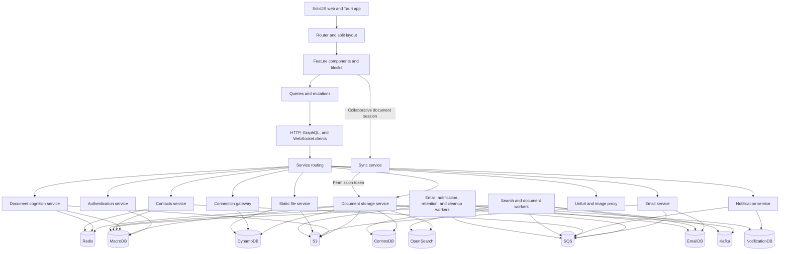
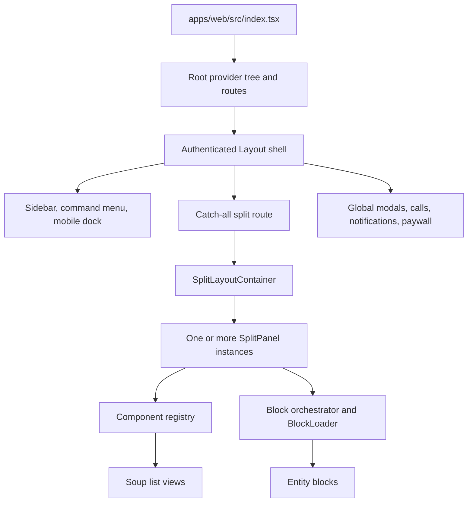
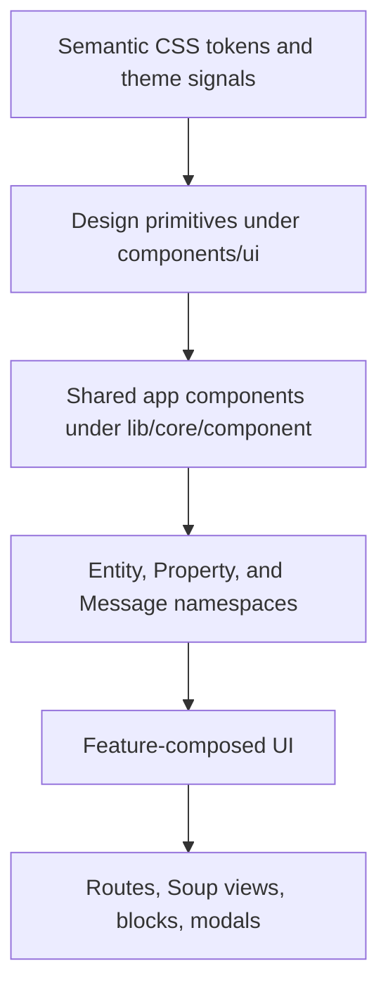
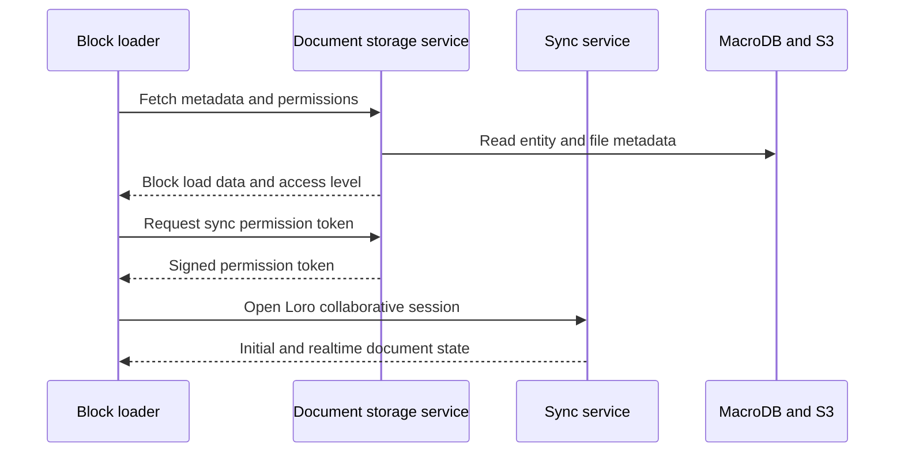
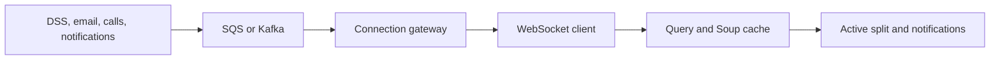
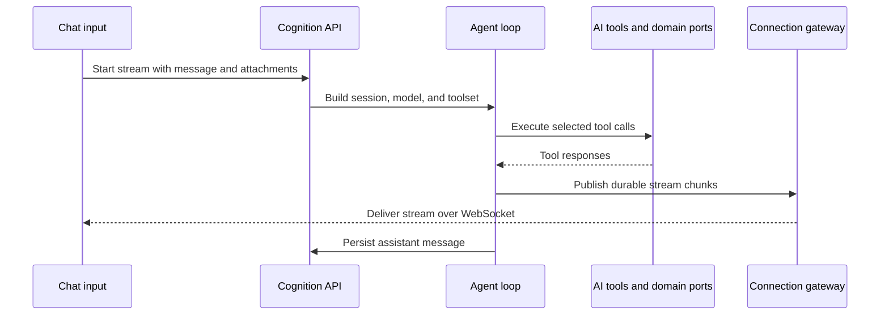
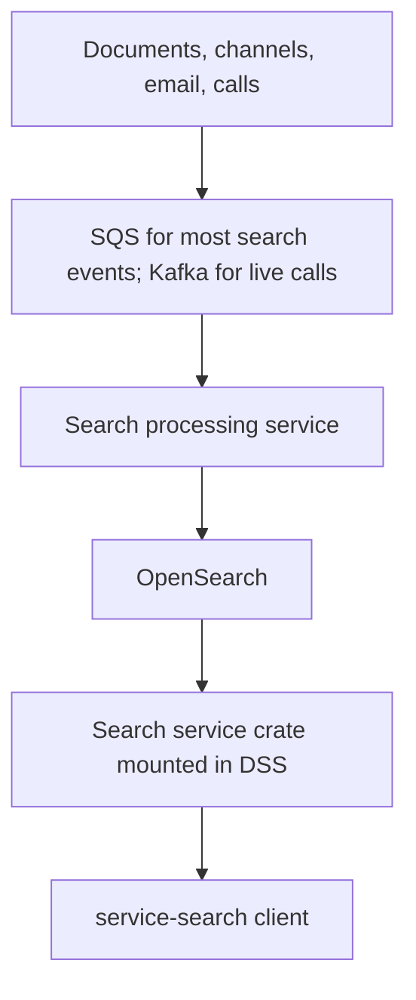

# Platform architecture canvas

> Last verified: 2026-08-19
> Status: current-state architecture map
> Companion docs: [feature map](./feature-map.md) ·
> [UI/UX catalog](./ui-ux-component-catalog.md)

This is a documentation canvas, not a Macro `.canvas` whiteboard file. It
connects the platform's user-facing surfaces to the frontend shell, API
contracts, deployable processes, mounted Rust domains, and data infrastructure.

## Canvas index

1. [System view](#system-view)
2. [Frontend composition](#frontend-composition)
3. [API and client boundaries](#api-and-client-boundaries)
4. [Deployable services](#deployable-services)
5. [Mounted Rust domains](#mounted-rust-domains)
6. [Data and asynchronous infrastructure](#data-and-asynchronous-infrastructure)
7. [Critical end-to-end flows](#critical-end-to-end-flows)
8. [Legacy and uncertain mappings](#legacy-and-uncertain-mappings)
9. [Source index](#source-index)

## System view



The main ownership model:

- The web app is one SolidJS application under
  [`apps/web`](../../../apps/web/).
- Most workspace data APIs are composed into
  [`document_storage_service`](../../../services/document_storage_service/),
  abbreviated DSS.
- Chat, AI streaming, memory, projections, imports, and outbound MCP
  connections are composed into
  [`document_cognition_service`](../../../services/document_cognition_service/),
  abbreviated DCS.
- Email synchronization and mailbox operations belong to
  [`email_service`](../../../services/email_service/).
- Realtime entity and stream delivery uses
  [`connection_gateway`](../../../services/connection_gateway/).
- Collaborative document state uses the Cloudflare
  [`sync-service`](../../../services/sync-service/), with permission tokens
  issued by DSS.
- Search is split between a query router mounted in DSS and asynchronous
  indexing in
  [`search_processing_service`](../../../services/search_processing_service/).

## Frontend composition

### Shell and navigation



| Layer | Responsibility | Confirmed source |
|---|---|---|
| Entry | Bootstraps SolidJS | [`apps/web/src/index.tsx`](../../../apps/web/src/index.tsx) |
| Provider/router root | Auth state, team, entity, calls, search, notifications, connection gateway, analytics, Tauri router | [`routes/Root.tsx`](../../../apps/web/src/routes/Root.tsx) |
| App shell | Sidebar, command surfaces, global modals, mobile chrome, authenticated redirects | [`components/app/Layout.tsx`](../../../apps/web/src/components/app/Layout.tsx) |
| Split route | Converts URL path segments to split layout input | [`SplitLayoutRoute.tsx`](../../../apps/web/src/components/app/split-layout/SplitLayoutRoute.tsx) |
| Split engine | Multi-panel state, sizing, preview pairs, mobile navigation, URL synchronization | [`components/app/split-layout`](../../../apps/web/src/components/app/split-layout/) |
| Component split registry | List views, settings, compose flows, and local galleries | [`componentRegistry.tsx`](../../../apps/web/src/components/app/split-layout/componentRegistry.tsx) |
| Block registry | Entity viewer/editor types and aliases | [`lib/core/block.ts`](../../../apps/web/src/lib/core/block.ts) |
| Block discovery | Loads every `block-*/definition.ts` and validates concrete coverage | [`allBlocks.ts`](../../../apps/web/src/lib/core/constant/allBlocks.ts) |
| Block mount | Loads data and mounts the block component in a split | [`orchestrator.tsx`](../../../apps/web/src/lib/core/orchestrator.tsx), [`BlockLoader.tsx`](../../../apps/web/src/lib/core/internal/BlockLoader.tsx) |
| Unified lists | Shared filters, grouping, tabs, rows, selection, and previews | [`features/next-soup`](../../../apps/web/src/features/next-soup/) |

### URL and split model

The web router base is `/app`; Tauri uses `/`. Canonical workspace URLs encode
alternating pairs:

```text
/component/inbox
/component/mail/email/<thread-id>
/md/<document-id>
/task/<document-id>
/channel/<channel-id>
/settings/account
```

`task`, `snippet`, and `skill` resolve to the `md` block; `csv` resolves to
`code`. `write` is a virtual legacy block that resolves to `pdf` when DOCX to
PDF support is enabled.

Decode and encode behavior is in
[`layoutUtils.ts`](../../../apps/web/src/components/app/split-layout/layoutUtils.ts)
and
[`layoutManager.ts`](../../../apps/web/src/components/app/split-layout/layoutManager.ts).
Preview-pair persistence is in
[`previewPersistence.ts`](../../../apps/web/src/components/app/split-layout/previewPersistence.ts).

Top-level shortcuts such as `/inbox`, `/mail`, `/tasks`, and `/channels` are
declared in `Root.tsx`. `list-views.ts` also assigns `/search` and `/folders`,
but those two paths are not top-level `Root.tsx` entries. The confirmed
component IDs are `search` and `folders`.

### UI layers



The intended dependency direction is from small query-free primitives to
feature-owned data orchestration. The detailed audit inventory is in
[ui-ux-component-catalog.md](./ui-ux-component-catalog.md).

## API and client boundaries

### Frontend boundary

All network calls should pass through
[`apps/web/src/lib/service-clients`](../../../apps/web/src/lib/service-clients/).
Shared server-state queries and mutations live under
[`apps/web/src/lib/queries`](../../../apps/web/src/lib/queries/); feature-local
orchestration can stay with its owning feature.

| Frontend client | Runtime owner | Contract |
|---|---|---|
| `service-auth` | Authentication service | `service-auth/openapi.json` |
| `service-storage` | DSS and its mounted domains | `service-storage/openapi.json` plus Soup GraphQL |
| `service-cognition` | DCS | `service-cognition/openapi.json` |
| `service-email` | Email service | `service-email/openapi.json` |
| `service-connection` | Connection gateway | OpenAPI control endpoints plus WebSocket |
| `service-contacts` | Contacts service | `service-contacts/openapi.json` |
| `service-notification` | Notification service | `service-notification/openapi.json` |
| `service-properties` | Properties router mounted in DSS | `service-properties/openapi.json` |
| `service-search` | Search query router mounted in DSS | `service-search/openapi.json` |
| `service-static-files` | Static file service | `service-static-files/openapi.json` |
| `service-unfurl` | Unfurl service | `service-unfurl/openapi.json` |
| `service-scheduled-action` | Scheduled-action deployable | `service-scheduled-action/openapi.json` |
| `service-call` | Call router mounted in DSS | Call-specific client |
| `service-sync` | Cloudflare sync service | Hand-written collaboration client |
| `service-stripe` | Billing/auth integration | Hand-written client |

The host and proxy mapping is
[`servers.ts`](../../../apps/web/src/lib/core/constant/servers.ts). Generated
client configuration is
[`orval.config.ts`](../../../apps/web/src/lib/service-clients/orval.config.ts).

### Contract locations

| Contract | Location | Use |
|---|---|---|
| Web OpenAPI copies | [`apps/web/src/lib/service-clients/service-*/openapi.json`](../../../apps/web/src/lib/service-clients/) | Orval-generated web clients |
| SDK OpenAPI copies | [`packages/sdk/specs`](../../../packages/sdk/specs/) | Public TypeScript SDK generation |
| SDK service list | [`packages/sdk/services.ts`](../../../packages/sdk/services.ts) | Supported generated services |
| GraphQL SDL | [`static_assets/schema.graphql`](../../../static_assets/schema.graphql) | Complete Graph/Soup schema |
| Web GraphQL operations | [`service-storage/graphql`](../../../apps/web/src/lib/service-clients/service-storage/graphql/) | Soup and entity queries |
| AI tool schemas | [`gen_tool_schemas.rs`](../../../crates/ai_tools/src/bin/gen_tool_schemas.rs) and generated [`service-cognition/tools`](../../../apps/web/src/lib/service-clients/service-cognition/generated/tools/) | Rust tool definitions and frontend tool rendering |
| Generated MCP docs | [`apps/docs/AI/mcp/tools`](../../../apps/docs/AI/mcp/tools/) | External agent-facing tool reference |

The generated contract is more authoritative than a service README. Rust
endpoints should use compile-time-checked API/schema generation where the
service already does so.

## Deployable services

### Local stack Rust inventory

[`RUST_SERVICES`](../../../tooling/xtask/crates/xtask_local/src/local/inventory.rs)
is the authoritative list of Rust binaries managed by the local orchestrator.

| Deployable | Package/binary | Proxy path | Primary role |
|---|---|---|---|
| Authentication (`authentication-service`) | `authentication_service` | `/auth` | Login, OAuth, sessions, users, teams, billing webhooks |
| Connection gateway | `connection_gateway` / `connection_gateway_service` | `/connection-gateway` WebSocket | Realtime stream, entity, and notification delivery |
| Contacts | `contacts_service` | `/contacts` | User contacts and contact graph |
| Document cognition | `document_cognition_service` | `/cognition` | Chats, AI streaming, memory, projections, imports, MCP |
| Document storage | `document_storage_service` | `/dss` | Workspace API composition root |
| Email | `email_service` | `/email` | Gmail sync, threads, messages, drafts, calendar watch/mutations |
| Notification | `notification_service` | `/notification` | Notification list, preferences, devices, delivery |
| Static files | `static_file_service` | bespoke `/static-file` route | File metadata and S3-backed delivery |
| Unfurl | `unfurl_service` | `/unfurl` | Link previews and proxying |
| Image proxy | `image_proxy_service` | `/image-proxy` | Safe proxying of external/email images |
| Search processing | `search_processing_service` | none | Asynchronous indexing and backfill |
| Upload finalizer worker | `document_upload_finalizer_handler` / `document_upload_finalizer_local_worker` | none | Portless upload finalization |
| Email pubsub workers (`email_pubsub_workers`) | `email_service` / `pubsub_workers` | none | Portless mailbox event processing |
| Gmail forwarder sidecar (`gmail_forwarder`) | `seed_cli` | none | Inventory entry used by the generated local compose sidecar; not an HTTP service |

Router entrypoints:

- [`authentication_service/src/api/mod.rs`](../../../services/authentication_service/src/api/mod.rs)
- [`connection_gateway/src/api/mod.rs`](../../../services/connection_gateway/src/api/mod.rs)
- [`document_storage_service/src/api/mod.rs`](../../../services/document_storage_service/src/api/mod.rs)
- [`document_cognition_service/src/api/mod.rs`](../../../services/document_cognition_service/src/api/mod.rs)
- [`email_service/src/api/mod.rs`](../../../services/email_service/src/api/mod.rs)
- [`notification_service/src/api/mod.rs`](../../../services/notification_service/src/api/mod.rs)
- [`static_file_service/src/api/mod.rs`](../../../services/static_file_service/src/api/mod.rs)
- [`contacts_service/src/main.rs`](../../../services/contacts_service/src/main.rs)
- [`unfurl_service/src/api/mod.rs`](../../../services/unfurl_service/src/api/mod.rs)
- [`image_proxy_service/src/api/mod.rs`](../../../services/image_proxy_service/src/api/mod.rs)
- [`search_processing_service/src/api/mod.rs`](../../../services/search_processing_service/src/api/mod.rs)

### Other independently deployed processes

| Deployable | Location | Role |
|---|---|---|
| Scheduled actions | [`services/scheduled_action`](../../../services/scheduled_action/) | Schedules and executes agent tasks |
| Convert service | [`services/convert_service`](../../../services/convert_service/) | Internal document format conversion |
| MCP service | [`services/mcp_service`](../../../services/mcp_service/) | Standalone Macro MCP server |
| MCP auth proxy | [`services/mcp_auth_proxy`](../../../services/mcp_auth_proxy/) | OAuth proxy for MCP |
| Sync service | [`services/sync-service`](../../../services/sync-service/) | Cloudflare Worker and Durable Objects for Loro collaboration |
| Lexical service | [`services/lexical-service`](../../../services/lexical-service/) | Text/search/AI export from collaborative documents |
| AI editing worker | [`services/ai-editing-worker`](../../../services/ai-editing-worker/) | Agent document editing through sync |
| Coding-agent worker | [`services/coding-agent-worker`](../../../services/coding-agent-worker/) | Cloudflare agent runtime; direct UI exposure is not confirmed |
| Analytics proxy | [`services/analytics-proxy`](../../../services/analytics-proxy/) | Analytics forwarding |
| Transcription | [`services/transcription`](../../../services/transcription/) | LiveKit transcription sidecar |

### Lambda and batch families

| Family | Implementations |
|---|---|
| Document ingestion | [`document_text_extractor`](../../../services/document_text_extractor/), [`docx_unzip_handler`](../../../services/docx_unzip_handler/), [`upload_extractor_lambda_handler`](../../../services/upload_extractor_lambda_handler/), [`upload_extractor_lambda_trigger`](../../../services/upload_extractor_lambda_trigger/) |
| Search | [`search_upload_handler`](../../../services/search_upload_handler/), [`search_processing_service`](../../../services/search_processing_service/) |
| Chat cleanup | [`delete_chat_handler`](../../../services/delete_chat_handler/) |
| Email operations | [`email_refresh_handler`](../../../services/email_refresh_handler/), [`email_scheduled_handler`](../../../services/email_scheduled_handler/), [`email_suppression_handler`](../../../services/email_suppression_handler/), [`email_sfs_delete_handler`](../../../services/email_sfs_delete_handler/) |
| Calls/media | [`call_recording_preview_handler`](../../../services/call_recording_preview_handler/), [`image_optimizer`](../../../services/image_optimizer/) |
| Retention/cleanup | [`organization_retention_trigger`](../../../services/organization_retention_trigger/), [`organization_retention_handler`](../../../services/organization_retention_handler/), [`deleted_item_poller`](../../../services/deleted_item_poller/), [`sha_cleanup_worker`](../../../services/sha_cleanup_worker/) |
| Safety/operations | [`dataloss_prevention_handler`](../../../services/dataloss_prevention_handler/), [`user_link_cleanup_handler`](../../../services/user_link_cleanup_handler/), [`worker_trigger`](../../../services/worker_trigger/) |
| AI projections | [`ai_projections_refresh_handler`](../../../services/ai_projections_refresh_handler/) |

## Mounted Rust domains

A crate listed below is not necessarily a separate microservice. Domain crates
usually expose inbound adapters that a deployable composition root mounts.
Architecture conventions are documented in the
[hexagonal architecture skill](../../../.agents/skills/cloud-storage-hexagonal-architecture/SKILL.md).

### DSS composition root

Confirmed composition root:
[`document_storage_service/src/main.rs`](../../../services/document_storage_service/src/main.rs)
and
[`src/api/mod.rs`](../../../services/document_storage_service/src/api/mod.rs).

| Product domain | Owning crate or module | Inbound/API entry |
|---|---|---|
| Documents, tasks, snippets, skills | [`crates/documents`](../../../crates/documents/) | `crates/documents/src/inbound/axum_router.rs` plus DSS legacy document routes |
| Projects/folders | [`crates/projects`](../../../crates/projects/) | `crates/projects/src/inbound/axum_router.rs` |
| Channels/messages | [`crates/channels`](../../../crates/channels/) | `axum_router.rs` and `list_router.rs` |
| Soup/unified lists | [`crates/soup`](../../../crates/soup/) | `crates/soup/src/inbound/axum_router.rs` |
| Soup GraphQL | [`crates/graphql_soup`](../../../crates/graphql_soup/) | `document_storage_service/src/api/graphql_soup.rs` |
| Search queries | [`crates/search_service`](../../../crates/search_service/) | `crates/search_service/src/api/mod.rs` |
| Properties/tags | [`crates/properties`](../../../crates/properties/) | `crates/properties/src/inbound/axum_router.rs` |
| CRM | [`crates/crm`](../../../crates/crm/) | `crates/crm/src/inbound/axum_router/mod.rs` |
| Calls | [`crates/call`](../../../crates/call/) | `crates/call/src/inbound/axum_router.rs` |
| Favorites | [`crates/favorites`](../../../crates/favorites/) | `crates/favorites/src/inbound/axum_router.rs` |
| Reminders | [`crates/reminders`](../../../crates/reminders/) | `crates/reminders/src/inbound/axum_router.rs` |
| Foreign entities | [`crates/foreign_entity`](../../../crates/foreign_entity/) | `crates/foreign_entity/src/inbound/axum_router.rs` |
| User webhooks | [`crates/webhook`](../../../crates/webhook/) | `crates/webhook/src/inbound/axum_router.rs` |
| Bots | [`crates/bots`](../../../crates/bots/) | `crates/bots/src/inbound/axum_router.rs` |
| GitHub sync | [`crates/github`](../../../crates/github/) | `crates/github/src/inbound/github_sync_router/mod.rs` |
| Calendar occurrence queries | [`crates/calendar_events`](../../../crates/calendar_events/) | `crates/calendar_events/src/inbound/axum_router.rs`; email service owns watch/mutations |
| cal.com webhooks | [`crates/cal`](../../../crates/cal/) | `crates/cal/src/inbound/cal_webhook_router/mod.rs` mounted at `/cal/webhook` |
| Sync wakeup | [`crates/sync_service`](../../../crates/sync_service/) | `crates/sync_service/src/inbound/axum_router.rs` |

DSS-native modules also own activity, pins, recents, history, annotations, saved
views, entity access, and internal routes under
[`services/document_storage_service/src/api`](../../../services/document_storage_service/src/api/).

### DCS composition root

Confirmed composition root:
[`document_cognition_service/src/main.rs`](../../../services/document_cognition_service/src/main.rs)
and
[`src/api/mod.rs`](../../../services/document_cognition_service/src/api/mod.rs).

| Product domain | Owning crate or module | Inbound/API entry |
|---|---|---|
| Chat CRUD and history | [`crates/chat`](../../../crates/chat/) | `crates/chat/src/inbound/http/router.rs`, mounted by DCS chats |
| Streaming/completions | DCS-native | `services/document_cognition_service/src/api/stream`, `completions`, `structured_completion` |
| Attachments, citations, preview, ID mapping | DCS-native | Modules under `services/document_cognition_service/src/api` |
| Agent loop | [`crates/agent`](../../../crates/agent/) | In-process library used by streaming and other agent consumers |
| Tool implementations | [`crates/ai_tools`](../../../crates/ai_tools/) | `all_tools()`, `mcp_tools()`, schema generation |
| Tool framework | [`crates/ai_toolset`](../../../crates/ai_toolset/) | Tool schema, collection, type generation |
| Unified memory | [`crates/memory`](../../../crates/memory/) | `crates/memory/src/inbound/axum_router.rs` |
| Import | [`crates/import`](../../../crates/import/) | `crates/import/src/inbound/axum_router.rs` |
| Onboarding AI | [`crates/onboarding`](../../../crates/onboarding/) | `crates/onboarding/src/inbound/axum_router.rs` |
| Usage metering | [`crates/ai_usage`](../../../crates/ai_usage/) | `crates/ai_usage/src/inbound/axum_router.rs` |
| AI projections | [`crates/ai_projections`](../../../crates/ai_projections/) | `crates/ai_projections/src/inbound/axum_router/mod.rs` |
| Outbound MCP servers | [`crates/mcp_client`](../../../crates/mcp_client/) | `crates/mcp_client/src/inbound/axum_router.rs` |

### Other composition roots

| Deployable | Mounted domain | Evidence |
|---|---|---|
| Authentication | Teams, referrals, and native-app routes | [`crates/teams`](../../../crates/teams/), [`crates/referral`](../../../crates/referral/), [`crates/native_app_service`](../../../crates/native_app_service/), auth `api/mod.rs` |
| Contacts | Contact graph | [`crates/contacts/src/inbound/http.rs`](../../../crates/contacts/src/inbound/http.rs) |
| Notification | Notification domain | [`crates/notification/src/inbound/http/mod.rs`](../../../crates/notification/src/inbound/http/mod.rs) |
| Email | Shared email domain and service-native mailbox routes | [`crates/email/src/inbound/axum`](../../../crates/email/src/inbound/axum/), [`email_service/src/api/email`](../../../services/email_service/src/api/email/) |
| Unfurl | Unfurl domain | [`crates/unfurl`](../../../crates/unfurl/) |

## Data and asynchronous infrastructure

| System | Client/schema | Primary ownership |
|---|---|---|
| MacroDB/Postgres | [`crates/macro_db_client`](../../../crates/macro_db_client/) | Workspace entities, users, teams, CRM, documents, chat metadata, properties, calls, reminders |
| CommsDB/Postgres | [`crates/comms_db_client`](../../../crates/comms_db_client/) | Channels and messages |
| EmailDB/Postgres | [`crates/email_db_client`](../../../crates/email_db_client/) | Mailbox threads, messages, drafts, sync metadata |
| NotificationDB/Postgres | [`crates/notification_db_client`](../../../crates/notification_db_client/) | Notification history and preferences |
| S3 | AWS adapters in services/crates | Document bytes, static files, attachments, call recordings, conversion artifacts |
| Redis | [`crates/macro_redis`](../../../crates/macro_redis/) | Caching, rate limiting, streams, worker coordination |
| OpenSearch | [`crates/opensearch_client`](../../../crates/opensearch_client/) | Cross-entity search indexes |
| DynamoDB | [`crates/dynamodb_client`](../../../crates/dynamodb_client/) | Connection tracking, static-file metadata, bulk upload coordination |
| Kafka | [`crates/kafka_util`](../../../crates/kafka_util/), [`crates/macro_event_broker`](../../../crates/macro_event_broker/) | Live call events into search processing and Soup realtime |
| SQS | [`crates/macro_queues`](../../../crates/macro_queues/) | Primary search-event path for non-call live entities and all backfills; also email, notifications, reminders, contacts, cleanup |
| Cloudflare Durable Objects/D1/KV | Sync/Lexical/AI editing workers | Collaborative state, document export, AI edit sessions |
| FusionAuth | [`crates/fusionauth`](../../../crates/fusionauth/) | Identity |
| LiveKit | Call outbound adapters and transcription service | Calls, media, transcription |

Contacts schema is now represented by a MacroDB migration
([`20260126191437_contacts_db_schema.sql`](../../../crates/macro_db_client/migrations/20260126191437_contacts_db_schema.sql)).
Older documentation that treats ContactsDB as independent may be stale.

## Critical end-to-end flows

### Document open and collaboration



Primary sources:

- [`BlockLoader.tsx`](../../../apps/web/src/lib/core/internal/BlockLoader.tsx)
- [`packages/collaboration`](../../../packages/collaboration/)
- [`services/sync-service`](../../../services/sync-service/)
- [`docs/CLOUD_STORAGE.md`](../../CLOUD_STORAGE.md)

### Upload, extraction, and search

```mermaid
flowchart LR
  Upload["Client upload"]
  DSS["DSS metadata and upload APIs"]
  S3["S3 object"]
  Finalize["Upload finalizer"]
  Extract["Text and DOCX extractors"]
  SearchEvent["Search event"]
  SearchWorker["Search processing"]
  OpenSearch["OpenSearch index"]
  SearchApi["Search API mounted in DSS"]

  Upload --> DSS --> S3
  S3 --> Finalize --> Extract --> SearchEvent --> SearchWorker --> OpenSearch
  OpenSearch --> SearchApi
```



The exact branch varies by file type. The confirmed service family includes
document text extraction, DOCX unzip, upload extraction/finalization, search
upload handling, and search processing.

### Realtime entity and notification flow



Not every event follows the same broker path. The confirmed browser endpoint is
the connection-gateway WebSocket initialized in
[`Root.tsx`](../../../apps/web/src/routes/Root.tsx) and implemented under
[`service-connection`](../../../apps/web/src/lib/service-clients/service-connection/).

### AI chat and tool flow



The browser POST starts the stream; tokens and tool parts arrive over
connection gateway. See the detailed
[chat feature tree](./feature-map.md#chat-and-agents).

### Search split



This distinction matters: `search_service` is the query-domain crate mounted in
DSS; `search_processing_service` is an independently running indexer.

## Legacy and uncertain mappings

| Item | Classification | Evidence and guidance |
|---|---|---|
| `websocket-service` | Legacy/stub | [`services/websocket-service/src/index.ts`](../../../services/websocket-service/src/index.ts) is a Bun placeholder. Use connection gateway for confirmed production realtime. |
| `scheduled_action` local routing | Confirmed deployable, not in local Rust inventory | Frontend runtime config uses port `8098`, while the OpenAPI generation registry uses `8099`; `RUST_SERVICES` does not include it. Verify the intended local process before calling or regenerating it. |
| `pdf-service` | External/legacy | Listed in frontend hosts with “no local container”; no Rust service appears in `RUST_SERVICES`. |
| `service-organization` | Likely stale generation config | Referenced by Orval configuration, but no matching generated client directory was found during verification. |
| Separate ContactsDB | Legacy documentation | Current contacts schema migration is in MacroDB. Validate operational environments before deleting old setup paths. |
| Separate comms service | Legacy documentation | CommsDB remains, but channel HTTP is confirmed as a domain router mounted in DSS. |
| DCS local port in README | Stale/uncertain | Runtime inventory and `servers.ts` should win over an older service README. |
| Email shared router mount details | Partly uncertain | Service-native and shared email routers both exist. Trace the exact mount before moving an endpoint. |
| Coding-agent worker product surface | Uncertain | Deployable exists; direct frontend ownership was not confirmed. |
| Transcription UI relationship | Partly confirmed | LiveKit/transcription infrastructure exists; verify the exact call UI behavior for feature work. |

## Source index

### Frontend

- [`apps/web/AGENTS.md`](../../../apps/web/AGENTS.md)
- [`apps/web/src/routes/Root.tsx`](../../../apps/web/src/routes/Root.tsx)
- [`apps/web/src/components/app/Layout.tsx`](../../../apps/web/src/components/app/Layout.tsx)
- [`apps/web/src/components/app/split-layout`](../../../apps/web/src/components/app/split-layout/)
- [`apps/web/src/lib/core/block.ts`](../../../apps/web/src/lib/core/block.ts)
- [`apps/web/src/lib/core/constant/allBlocks.ts`](../../../apps/web/src/lib/core/constant/allBlocks.ts)
- [`apps/web/src/lib/service-clients`](../../../apps/web/src/lib/service-clients/)
- [`apps/web/src/lib/queries`](../../../apps/web/src/lib/queries/)

### Backend

- [`tooling/xtask/.../inventory.rs`](../../../tooling/xtask/crates/xtask_local/src/local/inventory.rs)
- [`services/document_storage_service`](../../../services/document_storage_service/)
- [`services/document_cognition_service`](../../../services/document_cognition_service/)
- [`services/email_service`](../../../services/email_service/)
- [`services/connection_gateway`](../../../services/connection_gateway/)
- [`services/search_processing_service`](../../../services/search_processing_service/)
- [`crates`](../../../crates/)

### Contracts and architecture references

- [`packages/sdk/specs`](../../../packages/sdk/specs/)
- [`static_assets/schema.graphql`](../../../static_assets/schema.graphql)
- [`docs/CLOUD_STORAGE.md`](../../CLOUD_STORAGE.md)
- [`docs/STYLE_GUIDE.md`](../../STYLE_GUIDE.md)
- [`crates/complete_graph/AGENTS.md`](../../../crates/complete_graph/AGENTS.md)
- [Hexagonal architecture skill](../../../.agents/skills/cloud-storage-hexagonal-architecture/SKILL.md)
