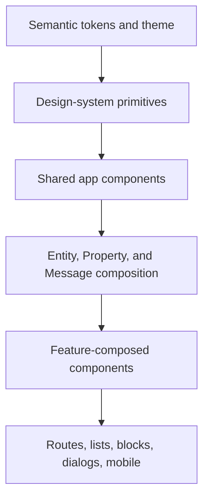

# UI/UX component catalog

> Last verified: 2026-08-19
> Scope: `apps/web/src`, SolidJS, Tailwind CSS v4, Kobalte, and selected Corvu components
> Audit state: manually inventoried snapshot; visual, accessibility, responsive, and theme review pending

This is the single-file UI/UX audit catalog. It is meant to let a designer or
agent understand the available visual system before adding or replacing UI.
For routes and service ownership, use the [feature map](./feature-map.md).

## Catalog boundary

Included:

- every source component in [`components/ui`](../../../apps/web/src/components/ui/),
  including non-barrel internals;
- application chrome and split/mobile shells under
  [`components/app`](../../../apps/web/src/components/app/);
- shared rendering families under
  [`lib/core/component`](../../../apps/web/src/lib/core/component/);
- the `Entity`, `Property`, and channel `Message` composed namespaces;
- every top-level feature family and every block viewer family;
- icons, illustrations, semantic tokens, theme tooling, and live debug
  galleries.

High-cardinality systems such as LexicalMarkdown, AI tool renderers, channel
messages, and PDF/canvas internals are cataloged by rendering family and
entrypoint. Pure query modules, generated API clients, tests, types, and
non-rendering utilities are excluded.

Status vocabulary:

- **Active**: current production pattern.
- **Flagged**: implementation exists but availability is gated.
- **Internal**: local/dev audit or debug surface.
- **Legacy**: retained but not preferred for new work.
- **Known debt**: explicitly called out as a poor reference in
  [`apps/web/AGENTS.md`](../../../apps/web/AGENTS.md).

## UI architecture

| Tier | Import/path boundary | Intended responsibility |
|---|---|---|
| Tokens | [`index.css`](../../../apps/web/src/index.css), theme signals | Semantic color, depth, typography, spacing, z-index, motion |
| Design primitives | `@ui` → [`components/ui/index.ts`](../../../apps/web/src/components/ui/index.ts) | Small, reusable, query-free controls and layout primitives |
| Shared app components | `@core/component/*` | Cross-feature rendering and interaction patterns |
| Composed namespaces | `@entity`, `@property`, `@channel/Message` | Slot-based domain display systems |
| Feature UI | `features/*` | Data-aware, use-case-specific composition |
| App surfaces | routes, list views, blocks, global modals | Complete workflows |

The preferred design direction is composition over large configurable
components. Good references named by repository guidance are `entity`,
`channel`, `block-md`, and `next-soup`. `block-channel` and `block-pdf` are
explicit known-debt examples.

## Design-system primitives

Public exports are defined by
[`components/ui/index.ts`](../../../apps/web/src/components/ui/index.ts).

### Public `@ui` components

| Component | Source | Purpose | Variants and states | Status/audit notes |
|---|---|---|---|---|
| Avatar, AvatarGroup | [`Avatar.tsx`](../../../apps/web/src/components/ui/components/Avatar.tsx) | Compound image/fallback avatar and grouped users | `sm`, `md`, `lg`, `fill`; image failure; grouped overflow | Active; audit fallback contrast and group labels |
| Button | [`Button.tsx`](../../../apps/web/src/components/ui/components/Button.tsx) | Primary action primitive with Layer and optional tooltip/hotkey | `ghost`, `base`, `active`, `success`, `danger`, `contrast`, `cta`; `xs`–`lg`; icon sizes; disabled/focus/touch | Active; highest-reuse primitive |
| ButtonGroup | [`ButtonGroup.tsx`](../../../apps/web/src/components/ui/components/ButtonGroup.tsx) | Shares Button size/variant context | Inherited variant, size, disabled state | Active |
| Calendar, CalendarMonthMenu | [`Calendar.tsx`](../../../apps/web/src/components/ui/components/Calendar.tsx) | Corvu date grid and month selection | Month navigation, selected day, disabled day | Active; audit keyboard/focus and locale behavior |
| ChatInput | [`ChatInput.tsx`](../../../apps/web/src/components/ui/components/ChatInput.tsx) | Visual grid shell for AI/chat composers | One-, two-, and three-row layouts | Active; not the full data-aware chat composer |
| Checkbox, InlineCheckbox, SingleSelectCheck | [`Checkbox.tsx`](../../../apps/web/src/components/ui/components/Checkbox.tsx) | Kobalte compound checkbox patterns | Checked, indeterminate, disabled, invalid | Active |
| CollapsedInput | [`CollapsedInput.tsx`](../../../apps/web/src/components/ui/components/CollapsedInput.tsx) | Compact-to-expanded input with attachment affordance | Collapsed, focused, attachment count | Active |
| CommandMenu primitives | [`CommandMenuPrimitives.tsx`](../../../apps/web/src/components/ui/components/CommandMenuPrimitives.tsx) | Shell, search, list, item, empty state, hotkey hint | Search/no-results, highlighted/disabled list items | Active; explicit listbox behavior |
| Dialog | [`Dialog.tsx`](../../../apps/web/src/components/ui/components/Dialog.tsx) | Kobalte modal compound | Center/top, fullscreen, scrim, handoff animation, open/closed | Active; audit nested-dialog and mobile behavior |
| Dropdown | [`Dropdown.tsx`](../../../apps/web/src/components/ui/components/Dropdown.tsx) | Compound menu, submenus, checkbox/radio items | Highlighted, checked, disabled, sub-menu; Ctrl+J/K | Active |
| EmptyStatePanel | [`EmptyStatePanel.tsx`](../../../apps/web/src/components/ui/components/EmptyStatePanel.tsx) | Graphic, title, description, actions | Centered or column layout; status role | Active |
| FilteredHiddenBanner | [`FilteredHiddenBanner.tsx`](../../../apps/web/src/components/ui/components/FilteredHiddenBanner.tsx) | Explains content hidden by filters | Visible/dismissed | Active |
| Hotkey | [`Hotkey.tsx`](../../../apps/web/src/components/ui/components/Hotkey.tsx) | Keyboard shortcut chip | Tokenized and raw shortcut strings | Active |
| HoverCard | [`HoverCard.tsx`](../../../apps/web/src/components/ui/components/HoverCard.tsx) | Kobalte hover/focus content | Open delay, close delay, placement | Active; compare with legacy core HoverCard |
| Layer | [`Layer.tsx`](../../../apps/web/src/components/ui/components/Layer.tsx) | Recomputes semantic surface colors by depth | Depth `0`–`5`; light/dark/mobile behavior | Active; foundational theme primitive |
| LogoProgress | [`LogoProgress.tsx`](../../../apps/web/src/components/ui/components/LogoProgress.tsx) | Branded indeterminate progress | Animating | Active |
| NavRow | [`NavRow.tsx`](../../../apps/web/src/components/ui/components/NavRow.tsx) | Sidebar/navigation row | Active/inactive, icon/label/action | Active |
| Panel | [`Panel.tsx`](../../../apps/web/src/components/ui/components/Panel.tsx) | Compound panel grid | Header, toolbar, body, footer; scrolling body | Active |
| PillButton | [`PillButton.tsx`](../../../apps/web/src/components/ui/components/PillButton.tsx) | Rounded call-to-action | `cta`, `subtle`; optional icon | Active; low usage, check overlap with Button |
| Scroll | [`Scroll.tsx`](../../../apps/web/src/components/ui/components/Scroll.tsx) | Custom scroll viewport | Overflow and custom track | Active |
| SegmentedControl | [`SegmentedControl.tsx`](../../../apps/web/src/components/ui/components/SegmentedControl.tsx) | Single-choice segmented options | Selected/unselected, label | Active; audit keyboard semantics |
| SendButton | [`SendButton.tsx`](../../../apps/web/src/components/ui/components/SendButton.tsx) | Standard send affordance | Enabled/disabled; fixed accessible label | Active |
| SideNav | [`SideNav.tsx`](../../../apps/web/src/components/ui/components/SideNav.tsx) | Side-navigation shell | Sectioned/collapsed arrangements | Active |
| Surface | [`Surface.tsx`](../../../apps/web/src/components/ui/components/Surface.tsx) | Border and fill surface backed by Layer | Depth, active ring, solid, border visibility | Active |
| TabbedControl | [`TabbedControl.tsx`](../../../apps/web/src/components/ui/components/TabbedControl.tsx) | Compact tab strip | Selected/unselected | Active; review tab roles and wrappers |
| ToggleSwitch | [`ToggleSwitch.tsx`](../../../apps/web/src/components/ui/components/ToggleSwitch.tsx) | Kobalte binary switch | `xs`, `sm`, `md`; checked; disabled | Active |
| Tooltip | [`Tooltip.tsx`](../../../apps/web/src/components/ui/components/Tooltip.tsx) | Global tooltip wrapper | Placement, delay, globally enabled/disabled | Active |

### Non-barrel UI components

| Component/module | Source | Purpose | Status/audit notes |
|---|---|---|---|
| Pager | [`Pager/Pager.tsx`](../../../apps/web/src/components/ui/components/Pager/Pager.tsx) | Compound root/viewport/page controller for mobile paging | Active internal import; inactive pages use `aria-hidden` |
| Pager swipe gestures | [`PagerSwipeGestures.tsx`](../../../apps/web/src/components/ui/components/Pager/PagerSwipeGestures.tsx) | Touch navigation for Pager | Active; audit gesture conflict and reduced motion |
| Pager styles | [`pager.css`](../../../apps/web/src/components/ui/components/Pager/pager.css) | Page transition styling | Active |
| Stepper | [`Stepper.tsx`](../../../apps/web/src/components/ui/components/Stepper.tsx) | Multi-step transition container | Active internal import; directional slide/fade |
| ScreencastHotkeys | [`ScreencastHotkeys.tsx`](../../../apps/web/src/components/ui/components/ScreencastHotkeys.tsx) | On-screen shortcut overlay for demos | Internal; persisted enable state |
| UI signals | [`signals/signals.ts`](../../../apps/web/src/components/ui/signals/signals.ts) | Tooltip and monochrome-icon preferences | Active |
| Class merge | [`utils/classname.ts`](../../../apps/web/src/components/ui/utils/classname.ts) | `clsx` plus Tailwind merge | Active utility |
| Menu keyboard navigation | [`menuKeyboardNavigation.ts`](../../../apps/web/src/components/ui/utils/menuKeyboardNavigation.ts) | Ctrl+J/K and first-item navigation | Active behavior utility |
| Monochrome icons | [`monochromeIcons.ts`](../../../apps/web/src/components/ui/utils/monochromeIcons.ts) | Resolves icon mode from preference | Active utility |

## Application chrome

### Root shell

| Component | Source | Purpose | Status/audit notes |
|---|---|---|---|
| Layout | [`Layout.tsx`](../../../apps/web/src/components/app/Layout.tsx) | Authenticated application shell and global overlay host | Active; desktop/mobile branches |
| GlobalAppState | [`GlobalAppState.tsx`](../../../apps/web/src/components/app/GlobalAppState.tsx) | Global app services and state context | Active |
| GlobalHotkeys | [`GlobalHotkeys.tsx`](../../../apps/web/src/components/app/GlobalHotkeys.tsx) | App-wide shortcut wiring | Active; audit discoverability/conflicts |
| ItemDragAndDrop | [`ItemDragAndDrop.tsx`](../../../apps/web/src/components/app/ItemDragAndDrop.tsx) | Global entity drag-and-drop orchestration | Active |
| ResponsiveBlockToolbar | [`ResponsiveBlockToolbar.tsx`](../../../apps/web/src/components/app/ResponsiveBlockToolbar.tsx) | Narrow/wide block action layout | Active |
| BundleUpdateProgressBar | [`BundleUpdateProgressBar.tsx`](../../../apps/web/src/components/app/BundleUpdateProgressBar.tsx) | Application update progress | Active |
| FatalError | [`FatalError.tsx`](../../../apps/web/src/components/app/FatalError.tsx) | Fatal application error screen | Active; audit recovery action |
| ReactiveFavicon | [`ReactiveFavicon.tsx`](../../../apps/web/src/components/app/ReactiveFavicon.tsx) | Unread/activity favicon state | Active |

### Sidebar

| Component | Source | Purpose | Status/audit notes |
|---|---|---|---|
| App sidebar | [`sidebar.tsx`](../../../apps/web/src/components/app/app-sidebar/sidebar.tsx) | Primary list-view navigation, creation, favorites, calls, settings | Active |
| Collapsible sidebar section | [`collapsible-sidebar-section.tsx`](../../../apps/web/src/components/app/app-sidebar/collapsible-sidebar-section.tsx) | Expandable sidebar groups | Active |
| Sidebar promo | [`sidebar-promo.tsx`](../../../apps/web/src/components/app/app-sidebar/sidebar-promo.tsx) | Promotional/upgrade content | Active; audit interruption and dismissal |

### Split layout

Core state and routing:

| Module | Source | UX responsibility |
|---|---|---|
| SplitLayout | [`SplitLayout.tsx`](../../../apps/web/src/components/app/split-layout/SplitLayout.tsx) | Multi-panel desktop layout and mobile split host |
| SplitLayoutRoute | [`SplitLayoutRoute.tsx`](../../../apps/web/src/components/app/split-layout/SplitLayoutRoute.tsx) | Route-to-layout adapter |
| Layout manager | [`layoutManager.ts`](../../../apps/web/src/components/app/split-layout/layoutManager.ts) | Split lifecycle, content, focus, labels, history |
| URL sync | [`layoutUrlSync.ts`](../../../apps/web/src/components/app/split-layout/layoutUrlSync.ts) | Split state and browser URL reconciliation |
| Layout utilities | [`layoutUtils.ts`](../../../apps/web/src/components/app/split-layout/layoutUtils.ts) | Pair decoding, aliases, settings URL handling |
| History | [`history.ts`](../../../apps/web/src/components/app/split-layout/history.ts) | Split-local navigation history |
| Preview controller | [`previewController.ts`](../../../apps/web/src/components/app/split-layout/previewController.ts) | Controller/viewer preview pairs |
| Preview persistence | [`previewPersistence.ts`](../../../apps/web/src/components/app/split-layout/previewPersistence.ts) | URL persistence for preview pairs |
| Split sizing | [`splitContentSizing.ts`](../../../apps/web/src/components/app/split-layout/splitContentSizing.ts) | Per-content minimum width |
| Focus tracker | [`splitFocusTracker.ts`](../../../apps/web/src/components/app/split-layout/splitFocusTracker.ts) | Active panel and keyboard focus |

Rendering components:

| Component | Source | Purpose/states |
|---|---|---|
| SplitPanel | [`components/SplitPanel.tsx`](../../../apps/web/src/components/app/split-layout/components/SplitPanel.tsx) | Focused/unfocused panel, resize and content host |
| SplitHeader | [`components/SplitHeader.tsx`](../../../apps/web/src/components/app/split-layout/components/SplitHeader.tsx) | Panel title/actions |
| SplitToolbar | [`components/SplitToolbar.tsx`](../../../apps/web/src/components/app/split-layout/components/SplitToolbar.tsx) | Panel toolbar row |
| SplitLabel | [`components/SplitLabel.tsx`](../../../apps/web/src/components/app/split-layout/components/SplitLabel.tsx) | Dynamic split label |
| SplitDrawer | [`components/SplitDrawer.tsx`](../../../apps/web/src/components/app/split-layout/components/SplitDrawer.tsx) | Open/closed drawer inside a split |
| SplitDrawerContext | [`components/SplitDrawerContext.tsx`](../../../apps/web/src/components/app/split-layout/components/SplitDrawerContext.tsx) | Drawer state and action boundary |
| SplitBottomPanel | [`components/SplitBottomPanel.tsx`](../../../apps/web/src/components/app/split-layout/components/SplitBottomPanel.tsx) | Expandable auxiliary bottom panel |
| SplitFileMenu | [`components/SplitFileMenu.tsx`](../../../apps/web/src/components/app/split-layout/components/SplitFileMenu.tsx) | File actions |
| HeaderIsland | [`components/HeaderIsland.tsx`](../../../apps/web/src/components/app/split-layout/components/HeaderIsland.tsx) | Mobile floating header chrome |
| HeaderTitleMenu | [`components/HeaderTitleMenu.tsx`](../../../apps/web/src/components/app/split-layout/components/HeaderTitleMenu.tsx) | Title/dropdown interaction |
| PreviewButton | [`components/PreviewButton.tsx`](../../../apps/web/src/components/app/split-layout/components/PreviewButton.tsx) | Preview-pair toggle |
| PopoverSplitRenderer | [`components/PopoverSplitRenderer.tsx`](../../../apps/web/src/components/app/split-layout/components/PopoverSplitRenderer.tsx) | Split content in a popover |
| CollapsibleItem | [`components/CollapsibleItem.tsx`](../../../apps/web/src/components/app/split-layout/components/CollapsibleItem.tsx) | Priority-collapse wrapper |
| Overflow sensor | [`components/PriorityCollapseOverflowSensor.tsx`](../../../apps/web/src/components/app/split-layout/components/PriorityCollapseOverflowSensor.tsx) | Detects when chrome must collapse |
| SplitButtons | [`SplitButtons.tsx`](../../../apps/web/src/components/app/split-layout/SplitButtons.tsx) | Split add/close/navigation actions |

Mobile split behavior is implemented by
[`mobile/MobileSplitContainer.tsx`](../../../apps/web/src/components/app/split-layout/mobile/MobileSplitContainer.tsx)
and its motion/gesture controllers in the same folder.

### Side panel and mobile chrome

| Component/family | Source | Purpose/states |
|---|---|---|
| SidePanel | [`side-panel/SidePanel.tsx`](../../../apps/web/src/components/app/side-panel/SidePanel.tsx) | Shared details/properties side panel |
| FileSidePanelSections | [`side-panel/FileSidePanelSections.tsx`](../../../apps/web/src/components/app/side-panel/FileSidePanelSections.tsx) | File metadata sections |
| MobileDock | [`mobile/MobileDock.tsx`](../../../apps/web/src/components/app/mobile/MobileDock.tsx) | Bottom application navigation |
| MobileDrawer | [`mobile/MobileDrawer.tsx`](../../../apps/web/src/components/app/mobile/MobileDrawer.tsx) | Corvu bottom drawer |
| PillTabs | [`mobile/PillTabs.tsx`](../../../apps/web/src/components/app/mobile/PillTabs.tsx) | Mobile selected-tab control |
| MobileTouchMenu | [`mobile/MobileTouchMenu.tsx`](../../../apps/web/src/components/app/mobile/MobileTouchMenu.tsx) | Long-press context menu |
| PullToRefresh | [`mobile/PullToRefresh.tsx`](../../../apps/web/src/components/app/mobile/PullToRefresh.tsx) | Pull gesture and refreshing state |
| SwipableRow | [`mobile/SwipableRow.tsx`](../../../apps/web/src/components/app/mobile/SwipableRow.tsx) | Swipe-reveal row actions |
| MobileEdgeFade | [`mobile/MobileEdgeFade.tsx`](../../../apps/web/src/components/app/mobile/MobileEdgeFade.tsx) | Scroll-edge affordance |
| SwipeDownDismissKeyboard | [`mobile/SwipeDownDismissKeyboard.tsx`](../../../apps/web/src/components/app/mobile/SwipeDownDismissKeyboard.tsx) | Mobile keyboard dismissal gesture |
| FloatRegion | [`mobile/float-regions/FloatRegion.tsx`](../../../apps/web/src/components/app/mobile/float-regions/FloatRegion.tsx) | Floating mobile chrome slot |
| FloatRegionHost | [`mobile/float-regions/FloatRegionHost.tsx`](../../../apps/web/src/components/app/mobile/float-regions/FloatRegionHost.tsx) | Floating-region portal/stack host |

## Shared core component families

### Common components

| Family | Source | Purpose | Status/audit notes |
|---|---|---|---|
| Block containers | [`BlockContainer.tsx`](../../../apps/web/src/lib/core/component/BlockContainer.tsx), [`DocumentBlockContainer.tsx`](../../../apps/web/src/lib/core/component/DocumentBlockContainer.tsx) | Block loading, permissions, and document shell | Active |
| Loading indicators | [`CircleSpinner.tsx`](../../../apps/web/src/lib/core/component/CircleSpinner.tsx), [`LoadingSpinner.tsx`](../../../apps/web/src/lib/core/component/LoadingSpinner.tsx), [`LoadingBlock.tsx`](../../../apps/web/src/lib/core/component/LoadingBlock.tsx), [`TailSpinner.tsx`](../../../apps/web/src/lib/core/component/TailSpinner.tsx) | Inline and panel loading states | Active; consolidate visual language |
| Access errors | [`AccessErrorViews`](../../../apps/web/src/lib/core/component/AccessErrorViews/) | Not found, unauthorized, gone | Active |
| ContextMenu | [`ContextMenu.tsx`](../../../apps/web/src/lib/core/component/ContextMenu.tsx) | Split/file contextual actions | Active; compare with `@ui` Dropdown |
| FileList | [`FileList`](../../../apps/web/src/lib/core/component/FileList/) | File tree rows, truncation, and spacing | Active |
| ScopedPortal | [`ScopedPortal.tsx`](../../../apps/web/src/lib/core/component/ScopedPortal.tsx) | Portals overlays within a split/container | Active |
| DetailsDrawer | [`DetailsDrawer.tsx`](../../../apps/web/src/lib/core/component/DetailsDrawer.tsx) | Shared details drawer | Active |
| DocumentPreview | [`DocumentPreview.tsx`](../../../apps/web/src/lib/core/component/DocumentPreview.tsx) | Document preview card | Active |
| Find | [`FindBar.tsx`](../../../apps/web/src/lib/core/component/FindBar.tsx) | In-document find and match navigation | Active |
| CustomScrollbar | [`CustomScrollbar.tsx`](../../../apps/web/src/lib/core/component/CustomScrollbar.tsx) | Overlay/custom scrollbar | Active; compare with `@ui` Scroll |
| Editable text | [`Editable.tsx`](../../../apps/web/src/lib/core/component/Editable.tsx), [`InlineTitleEditor.tsx`](../../../apps/web/src/lib/core/component/InlineTitleEditor.tsx) | Inline editing states | Active |
| Entity identity | [`EntityIcon.tsx`](../../../apps/web/src/lib/core/component/EntityIcon.tsx), [`FileTypeChip.tsx`](../../../apps/web/src/lib/core/component/FileTypeChip.tsx) | Entity/file visual identity | Active |
| EntityPermissionsGate | [`EntityPermissionsGate.tsx`](../../../apps/web/src/lib/core/component/EntityPermissionsGate.tsx) | Hides/replaces content without entity access | Active |
| User identity | [`UserIcon.tsx`](../../../apps/web/src/lib/core/component/UserIcon.tsx), [`UserGroup.tsx`](../../../apps/web/src/lib/core/component/UserGroup.tsx), [`UserTooltip.tsx`](../../../apps/web/src/lib/core/component/UserTooltip.tsx), [`StackedAvatarsRow.tsx`](../../../apps/web/src/lib/core/component/StackedAvatarsRow.tsx) | User/avatar displays | Active; compare overlap with `@ui` Avatar |
| ItemPreview | [`ItemPreview.tsx`](../../../apps/web/src/lib/core/component/ItemPreview.tsx) | Entity attachment/preview card | Active |
| FileDropOverlay | [`FileDropOverlay.tsx`](../../../apps/web/src/lib/core/component/FileDropOverlay.tsx) | Global/feature drag-over affordance | Active |
| FloatingInputLoader | [`FloatingInputLoader.tsx`](../../../apps/web/src/lib/core/component/FloatingInputLoader.tsx) | Loading state attached to an input | Active |
| EmailPermissionsBanner | [`EmailPermissionsBanner.tsx`](../../../apps/web/src/lib/core/component/EmailPermissionsBanner.tsx) | Warns about missing email access | Active |
| ForwardToChannel | [`ForwardToChannel.tsx`](../../../apps/web/src/lib/core/component/ForwardToChannel.tsx) | Selects a channel and forwards content | Active |
| Image previews | [`ImagePreview.tsx`](../../../apps/web/src/lib/core/component/ImagePreview.tsx), [`ImageGalleryPreview.tsx`](../../../apps/web/src/lib/core/component/ImageGalleryPreview.tsx) | Single and grouped image preview | Active |
| VideoPreview | [`VideoPreview.tsx`](../../../apps/web/src/lib/core/component/VideoPreview.tsx) | Video preview | Active |
| Lightbox | [`Lightbox`](../../../apps/web/src/lib/core/component/Lightbox/) | Full-screen image viewer, chrome, toolbar | Active |
| Sharing | [`RecipientSelector.tsx`](../../../apps/web/src/lib/core/component/RecipientSelector.tsx), [`SharePermissions.tsx`](../../../apps/web/src/lib/core/component/SharePermissions.tsx) | Recipients and access level | Active |
| References | [`References.tsx`](../../../apps/web/src/lib/core/component/References.tsx), [`ReferencesModal.tsx`](../../../apps/web/src/lib/core/component/ReferencesModal.tsx) | Backlinks/reference list and modal | Active/flagged |
| Tabs | [`Tabs.tsx`](../../../apps/web/src/lib/core/component/Tabs.tsx), [`TabsInset.tsx`](../../../apps/web/src/lib/core/component/TabsInset.tsx), [`TabsInsetDropdown.tsx`](../../../apps/web/src/lib/core/component/TabsInsetDropdown.tsx), [`MobileTabs.tsx`](../../../apps/web/src/lib/core/component/MobileTabs.tsx) | Older/shared tab patterns | Active; compare with `@ui` TabbedControl |
| Toast | [`Toast`](../../../apps/web/src/lib/core/component/Toast/) | Toast item and region stack | Active |
| TopBar | [`TopBar`](../../../apps/web/src/lib/core/component/TopBar/) | Shared block/document header slots | Active |
| Resize | [`Resize/Resize.tsx`](../../../apps/web/src/lib/core/component/Resize/Resize.tsx) | Resizable zones and handles | Active |
| Date picker | [`DatePicker`](../../../apps/web/src/lib/core/component/DatePicker/) | App-level date picker composition | Active |
| Emoji | [`Emoji`](../../../apps/web/src/lib/core/component/Emoji/) | Emoji picker/search | Active |
| Notifications | [`Notifications.tsx`](../../../apps/web/src/lib/core/component/Notifications.tsx), [`NotificationsModal.tsx`](../../../apps/web/src/lib/core/component/NotificationsModal.tsx), [`NotificationRenderer.tsx`](../../../apps/web/src/lib/core/component/NotificationRenderer.tsx) | Legacy/shared notification rendering | Review overlap with feature-owned notifications |
| Menus | [`OldMenu.tsx`](../../../apps/web/src/lib/core/component/OldMenu.tsx), [`GeneralizedPopup`](../../../apps/web/src/lib/core/component/GeneralizedPopup/) | Older menu/popup patterns | Legacy; prefer `@ui` Dropdown/Dialog |
| Core HoverCard | [`HoverCard.tsx`](../../../apps/web/src/lib/core/component/HoverCard.tsx) | Older shared hover card | Legacy/overlap; compare `@ui` HoverCard |
| Legacy Message | [`Message.tsx`](../../../apps/web/src/lib/core/component/Message.tsx) | Older message primitive | Legacy; distinct from channel Message namespace |
| Link | [`Link.tsx`](../../../apps/web/src/lib/core/component/Link.tsx) | Internal/external app link wrapper | Active |
| MacroLogo | [`MacroLogo.tsx`](../../../apps/web/src/lib/core/component/MacroLogo.tsx) | Branded logo mark | Active |
| ParamsProvider | [`ParamsProvider.tsx`](../../../apps/web/src/lib/core/component/ParamsProvider.tsx) | Parameter context wrapper for composed UI | Active |
| PcNoiseGrid | [`PcNoiseGrid.tsx`](../../../apps/web/src/lib/core/component/PcNoiseGrid.tsx) | Programmatic decorative noise grid | Active/internal visual utility |
| Themes | [`Themes.tsx`](../../../apps/web/src/lib/core/component/Themes.tsx) | Shared theme class/token helpers | Active; distinct from theme editor feature |
| Slider inputs | [`Slider.tsx`](../../../apps/web/src/lib/core/component/Slider.tsx), [`SlidableNumberInput.tsx`](../../../apps/web/src/lib/core/component/SlidableNumberInput.tsx) | Numeric/range interaction | Active |
| Presence | [`LiveIndicators.tsx`](../../../apps/web/src/lib/core/component/LiveIndicators.tsx) | Collaborative user presence | Active/flagged |
| Scroll indicators | [`VerticalScrollIndicators.tsx`](../../../apps/web/src/lib/core/component/VerticalScrollIndicators.tsx) | Top/bottom scroll affordance | Active |
| Zoom/pinch | [`Zoompinch.tsx`](../../../apps/web/src/lib/core/component/Zoompinch.tsx) | Gesture zoom wrapper | Active |

### LexicalMarkdown editor system

Root:
[`lib/core/component/LexicalMarkdown`](../../../apps/web/src/lib/core/component/LexicalMarkdown/).

| Subfamily | Key entrypoint | UI responsibility |
|---|---|---|
| Editor/viewer shell | [`component/core`](../../../apps/web/src/lib/core/component/LexicalMarkdown/component/core/) | Static markdown, editor textarea, links, decorator rendering |
| Builder | [`builder`](../../../apps/web/src/lib/core/component/LexicalMarkdown/builder/) | Configured editor composition |
| Floating menus | [`component/menu`](../../../apps/web/src/lib/core/component/LexicalMarkdown/component/menu/) | Format, link, equation, table, actions, mentions, snippets, skills, emoji, AI generation |
| Decorators | [`component/decorator`](../../../apps/web/src/lib/core/component/LexicalMarkdown/component/decorator/) | Mentions, images, video, equations, cards, diffs, HTML, links |
| Table/block affordances | [`component/misc`](../../../apps/web/src/lib/core/component/LexicalMarkdown/component/misc/) | Drag, insert, resize, move, delete, selection actions |
| Accessories | [`component/accessory`](../../../apps/web/src/lib/core/component/LexicalMarkdown/component/accessory/) | Code and AI-generation accessories |
| Collaboration | [`collaboration`](../../../apps/web/src/lib/core/component/LexicalMarkdown/collaboration/) | Remote cursors and collaborative editor UI |
| Status | [`component/status`](../../../apps/web/src/lib/core/component/LexicalMarkdown/component/status/) | Word count and editor status |
| Debug | [`component/debug`](../../../apps/web/src/lib/core/component/LexicalMarkdown/component/debug/) | Editor and parser audit surfaces |
| Theme/styles | [`theme.ts`](../../../apps/web/src/lib/core/component/LexicalMarkdown/theme.ts), [`styles.css`](../../../apps/web/src/lib/core/component/LexicalMarkdown/styles.css) | Markdown visual language |

This is the largest frontend component system and should be audited as an
editor product, not as isolated atoms.

### Shared AI/chat rendering system

Root:
[`lib/core/component/AI`](../../../apps/web/src/lib/core/component/AI/).

| Subfamily | Key entrypoint | UI responsibility |
|---|---|---|
| Composer | [`component/input`](../../../apps/web/src/lib/core/component/AI/component/input/) | ChatInput, model selector, attach menu, send/stop, consent |
| Message list | [`component/message`](../../../apps/web/src/lib/core/component/AI/component/message/) | Empty, user, assistant, thinking, activity groups |
| Tool rendering | [`component/tool`](../../../apps/web/src/lib/core/component/AI/component/tool/) | Approximately forty typed tool result/call UIs |
| Attachments | [`component/input/Attachment.tsx`](../../../apps/web/src/lib/core/component/AI/component/input/Attachment.tsx) | Entity/file attachment chips |
| Drag/drop | [`component/DragDrop.tsx`](../../../apps/web/src/lib/core/component/AI/component/DragDrop.tsx) | Drop overlay and attachment handoff |
| State/context | [`context/ChatContext.tsx`](../../../apps/web/src/lib/core/component/AI/context/ChatContext.tsx), [`state`](../../../apps/web/src/lib/core/component/AI/state/) | Composer and stream state boundaries |
| Debug | [`component/debug`](../../../apps/web/src/lib/core/component/AI/component/debug/) | Chat, tool, attachment, and stream galleries |

See the complete [chat feature tree](./feature-map.md#chat-and-agents).

## Composed component namespaces

### Entity

Public entry:
[`features/entity/index.ts`](../../../apps/web/src/features/entity/index.ts);
compound namespace:
[`entity.ts`](../../../apps/web/src/features/entity/entity.ts).

| Subsystem | Source | Purpose/states |
|---|---|---|
| Root/Layout/Slot | [`core`](../../../apps/web/src/features/entity/core/) | Context and named grid-slot composition |
| Base extractors | [`extractors`](../../../apps/web/src/features/entity/extractors/) | Icon, title, owner, timestamp, participants |
| Notification extractors | [`extractors-notification`](../../../apps/web/src/features/entity/extractors-notification/) | Notification icon, sender, content, stack, actions |
| Search extractors | [`extractors-search`](../../../apps/web/src/features/entity/extractors-search/) | Search hits, location, sender, timestamp |
| Property extractors | [`extractors-property`](../../../apps/web/src/features/entity/extractors-property/) | Key property values |
| ListEntity | [`composed/ListEntity.tsx`](../../../apps/web/src/features/entity/composed/ListEntity.tsx) | Routes entity data into list layouts |
| InlineEntity | [`composed/InlineEntity.tsx`](../../../apps/web/src/features/entity/composed/InlineEntity.tsx) | Compact entity mention/attachment |
| Per-type list layouts | [`composed/list-entity`](../../../apps/web/src/features/entity/composed/list-entity/) | Email, channel, task, call, reminder, automation, foreign entity, narrow/wide variants |
| Shared indicators | [`components`](../../../apps/web/src/features/entity/components/) | Badges, unread, selection, breadcrumb, display name |
| Entity modal | [`entity-modal`](../../../apps/web/src/features/entity/entity-modal/) | Rename/move and entity actions |
| Bulk editing | [`bulk-edit`](../../../apps/web/src/features/entity/bulk-edit/) | Bulk delete, move, rename |
| Entity selection toolbar | [`EntitySelectionToolbarModal.tsx`](../../../apps/web/src/features/entity/EntitySelectionToolbarModal.tsx) | Multi-select toolbar/modal |
| Debug gallery | [`debug/DebugEntityView.tsx`](../../../apps/web/src/features/entity/debug/DebugEntityView.tsx) | Internal layout matrix |

Status: **Active; preferred composition reference.**

### Property

Public entry:
[`features/property/index.ts`](../../../apps/web/src/features/property/index.ts);
compound namespace:
[`property.ts`](../../../apps/web/src/features/property/property.ts).

| Subsystem | Source | Purpose/states |
|---|---|---|
| Root/Layout/Slot | [`core`](../../../apps/web/src/features/property/core/) | Context and slot composition |
| Display extractors | [`extractors`](../../../apps/web/src/features/property/extractors/) | Label, icon, text, chips, user stack, empty state |
| Inline editors | [`editors/inline`](../../../apps/web/src/features/property/editors/inline/) | Text, number, boolean, link editing |
| Popover editors | [`editors/popover`](../../../apps/web/src/features/property/editors/popover/) | Select, entity, and date popovers |
| Selectors | [`editors/selectors`](../../../apps/web/src/features/property/editors/selectors/) | Entity, option, and date selection |
| Composed display | [`composed`](../../../apps/web/src/features/property/composed/) | Full and condensed property display/edit |
| Tags | [`tags`](../../../apps/web/src/features/property/tags/) | Tag picker, dots, rows, editor |
| Full editor modal | [`editor/PropertyEditorModal.tsx`](../../../apps/web/src/features/property/editor/PropertyEditorModal.tsx) | Definition/value management |
| Side-panel properties | [`side-panel`](../../../apps/web/src/features/property/side-panel/) | Entity properties section |
| Legacy propertyValue | [`component/propertyValue`](../../../apps/web/src/features/property/component/propertyValue/) | Older value display router |
| Legacy property modals | [`component/modal`](../../../apps/web/src/features/property/component/modal/) | `Modals` and `CreatePropertyModal`, still used by production task/property flows |
| Debug gallery | [`debug/PropertyDebug.tsx`](../../../apps/web/src/features/property/debug/PropertyDebug.tsx) | Internal property matrix |

Status: **Active**, with a legacy `component/propertyValue` layer still present.

### Channel Message

Compound namespace:
[`features/channel/Message/Message.ts`](../../../apps/web/src/features/channel/Message/Message.ts).

| Subsystem | Source | Purpose/states |
|---|---|---|
| Root/Layout/Slot | [`Message`](../../../apps/web/src/features/channel/Message/) | Context and message grid composition |
| ChannelMessage | [`ChannelMessage.tsx`](../../../apps/web/src/features/channel/Message/ChannelMessage.tsx) | Full row; selected, targeted, editing, mobile reply |
| Identity | `SenderIcon.tsx`, `SenderName.tsx`, `AgentBadge.tsx`, `BotIcon.tsx`, `FromPill.tsx` in [`Message`](../../../apps/web/src/features/channel/Message/) | Human, bot, agent, forwarded identity |
| Content | [`Content.tsx`](../../../apps/web/src/features/channel/Message/Content.tsx) | Markdown and rich content |
| Time/status | `Timestamp.tsx`, `EditedIndicator.tsx`, dividers in [`Message`](../../../apps/web/src/features/channel/Message/) | Timestamp, edited, date/new boundaries |
| Attachments/media | `Attachments.tsx`, `MediaPreview.tsx` | Files and media gallery |
| Reactions | `Reactions.tsx`, `ReactionChip.tsx`, `EmojiReactionPopover.tsx` | Add/remove reaction |
| Actions | `HoverActions.tsx`, `ActionMenu.tsx`, `SwipeToReplyRow.tsx` | Desktop hover and mobile gestures |
| Threads | [`Thread`](../../../apps/web/src/features/channel/Thread/) | Thread rows, replies, composer |

Status: **Active; preferred composition reference.**

## Feature-level UI families

The table covers every non-block top-level feature folder. Feature folders may
contain data hooks and utilities in addition to the listed rendering roots.

| Feature | Primary UI roots | User-facing surface | Status/audit focus |
|---|---|---|---|
| Activity timeline | [`features/activity-timeline`](../../../apps/web/src/features/activity-timeline/) | Activity feed and event rows | Flagged; empty/loading/grouping |
| Auth | [`features/auth`](../../../apps/web/src/features/auth/) | Login, signup, OTP, OAuth, re-auth prompts, `mobile-onboarding/`, signup banner | Active; form errors, focus, mobile |
| Calendar | [`features/calendar`](../../../apps/web/src/features/calendar/) | Calendar page, period selector, month drawer, event editor | Flagged; keyboard/date semantics |
| Channel | [`features/channel`](../../../apps/web/src/features/channel/) | Messages, threads, input, calls, participants, attachments, mobile actions | Active; large product subsystem |
| Channel invitations | [`features/channel-invitations`](../../../apps/web/src/features/channel-invitations/) | Invite acceptance | Active |
| Chat entry surfaces | [`features/chat`](../../../apps/web/src/features/chat/) | SoupChatInput and ChatWithAgentButton | Active |
| Command | [`features/command`](../../../apps/web/src/features/command/) | Command menu, launcher, favorites commands, mobile search | Active; keyboard navigation |
| Companies | [`features/companies`](../../../apps/web/src/features/companies/) | CRM creation and saved views | Flagged |
| Contacts | [`features/contacts`](../../../apps/web/src/features/contacts/) | CRM/contact detail support | Flagged |
| Devtools | [`features/devtools`](../../../apps/web/src/features/devtools/) | Status bar, hotkey and projection debug | Internal |
| Dynamic UI | [`features/dynamic-ui`](../../../apps/web/src/features/dynamic-ui/) | Agent-generated dashboard widgets and gallery | Active/internal gallery |
| Entity | [`features/entity`](../../../apps/web/src/features/entity/) | Cross-feature entity rendering | Active; preferred reference |
| Favorites | [`features/favorites`](../../../apps/web/src/features/favorites/) | Favorite icon and sidebar section | Active |
| Getting started | [`features/getting-started`](../../../apps/web/src/features/getting-started/) | First-run hub and example actions | Active |
| Home | [`features/home`](../../../apps/web/src/features/home/) | AI composer, recommendations, examples, recent sessions | Flagged |
| Inbox | [`features/inbox`](../../../apps/web/src/features/inbox/) | Add-inbox and sharing conflict dialogs | Active |
| Integrations | [`features/integrations`](../../../apps/web/src/features/integrations/) | Linear import and MCP setup | Active/varies |
| Next Soup | [`features/next-soup`](../../../apps/web/src/features/next-soup/) | Unified lists, tabs, filters, grouping, selection, previews | Active; preferred reference |
| Notifications | [`features/notifications`](../../../apps/web/src/features/notifications/) | Browser/OS notification prompts, navigation, read state, playground | Active |
| Onboarding | [`features/onboarding`](../../../apps/web/src/features/onboarding/) | Interactive tutorial, mobile web capture, mock app chrome | Active/legacy alongside setup v4 |
| Paywall | [`features/paywall`](../../../apps/web/src/features/paywall/) | Upgrade modal, plan grid, team variants | Active |
| Property | [`features/property`](../../../apps/web/src/features/property/) | Properties, tags, editors | Active |
| Reminders | [`features/reminders`](../../../apps/web/src/features/reminders/) | Reminder composer | Flagged |
| Settings | [`features/settings`](../../../apps/web/src/features/settings/) | Account, billing, appearance, team, tags, CRM, connections, MCP, bots, admin | Active/flagged by tab |
| Setup | [`features/setup`](../../../apps/web/src/features/setup/) | Full-screen onboarding v4 flow | Flagged |
| Sharing | [`features/sharing`](../../../apps/web/src/features/sharing/) | Global share modal and iOS share sheet | Active |
| Team invitations | [`features/team-invitations`](../../../apps/web/src/features/team-invitations/) | Invite acceptance and in-app invite modal | Active |
| Theme | [`features/theme`](../../../apps/web/src/features/theme/) | Theme list, editor, colors, chips, tools | Active |

### Settings layout kit

[`features/settings/primitives.tsx`](../../../apps/web/src/features/settings/primitives.tsx)
contains feature-scoped reusable patterns:

| Component | Purpose | Audit focus |
|---|---|---|
| SettingsPage | Settings title, description, and action shell | Narrow widths and heading hierarchy |
| SettingsSection | Titled grouping | Spacing consistency |
| SettingsCard | Layered outlined row container | Theme depth and dividers |
| SettingsRow | Label/control row with narrow stacking | Responsive control labels |
| IntegrationRow | Icon/title/status/action integration entry | Long names and disconnected/error states |

## Block viewer families

Block names are confirmed by
[`BlockRegistry`](../../../apps/web/src/lib/core/block.ts) and definitions under
`features/block-*/definition.ts`.

| Block family | Primary UI | Surface and notable states | Status |
|---|---|---|---|
| Markdown/task/snippet/skill | [`block-md/component`](../../../apps/web/src/features/block-md/component/) | Editor, notebook, format tools, outline, discussion, properties, history, find, compose | Active; preferred reference |
| PDF/write | [`block-pdf/component`](../../../apps/web/src/features/block-pdf/component/) | Viewer, tabs, markup, search, signature/placeables, popup | Active; known debt |
| Code/CSV | [`block-code/component`](../../../apps/web/src/features/block-code/component/) | CodeMirror editor, HTML preview, language/file chip | Active |
| Canvas | [`block-canvas`](../../../apps/web/src/features/block-canvas/) | Infinite canvas, nodes, selection, toolbar, floating menu | Active |
| Image | [`block-image/component`](../../../apps/web/src/features/block-image/component/) | Image viewer and top bar | Active |
| Video | [`block-video/component`](../../../apps/web/src/features/block-video/component/) | Video player and top bar | Flagged/active |
| Chat | [`block-chat/component`](../../../apps/web/src/features/block-chat/component/) | Chat messages, composer, tools, top bar, side panel | Active |
| Channel | [`block-channel/component`](../../../apps/web/src/features/block-channel/component/) | Block adapter and compose shell; rich UX lives in `features/channel` | Active; known debt adapter |
| Email | [`block-email/component`](../../../apps/web/src/features/block-email/component/) | Thread reader, message list, reply/compose, attachments, mobile drawer | Active |
| Call | [`block-call`](../../../apps/web/src/features/block-call/) | Recording/transcript block and call sidebar widgets | Flagged |
| Project/folder | [`block-project/component`](../../../apps/web/src/features/block-project/component/) | Folder/project block, top bar, create menu | Active |
| Automation | [`block-automation/component`](../../../apps/web/src/features/block-automation/component/) | Automation editor, prompt, schedule/time picker | Active |
| Company | [`block-company`](../../../apps/web/src/features/block-company/) | CRM company block adapter | Flagged |
| Contact | [`block-contact`](../../../apps/web/src/features/block-contact/) | CRM contact block adapter | Flagged |
| Pull request | [`block-pr/component`](../../../apps/web/src/features/block-pr/component/) | PR timeline, split header, GitHub message view | Active/integration-dependent |
| Unknown | [`block-unknown/component`](../../../apps/web/src/features/block-unknown/component/) | Fallback file/entity viewer | Active fallback |

## Tokens, assets, and visual language

### Global semantic tokens

[`apps/web/src/index.css`](../../../apps/web/src/index.css) is the primary token
source.

| Token family | Current model | Audit questions |
|---|---|---|
| Accent/base/contrast axes | OKLCH `--a0`–`--a4`, `--b0`–`--b4`, `--c0`–`--c4` | Do all themes preserve minimum contrast? |
| Semantic colors | `accent`, `surface`, `ink`, `ink-muted`, `edge`, `panel`, `menu`, `input`, `hover`, `active`, feedback colors | Are feature components using semantic tokens rather than raw palette values? |
| Entity colors | Task, email, PDF, channel, call, and other entity hues | Are entity colors distinguishable without color alone? |
| Depth | `Layer` remaps semantic surfaces by depth `0`–`5` | Are nested overlays/surfaces consistent? |
| Z-index | Named modal, action-menu, tooltip, toast, split, mobile values | Do nested overlays stack correctly? |
| Responsive variants | `touch`, `mobile`, `light-mode`, `dark-mode` | Are touch targets and mobile arrangements equivalent? |
| Motion | Dialog, slide, loading, island, and feature animations | Is reduced-motion behavior complete? |

Repository styling guidance: use semantic colors and do not add
`cursor-pointer` to clickable controls.

### Theme authoring

Theme UI lives in
[`features/theme/components`](../../../apps/web/src/features/theme/components/):
`ThemeEditor`, basic/advanced editors, `ThemeList`, CRUD, chips, swatches,
color picker, and tools. Runtime state is under
[`features/theme/signals`](../../../apps/web/src/features/theme/signals/).

### Icons and illustrations

| Asset family | Location | Approximate inventory | Notes |
|---|---|---|---|
| Static wide product icons | [`components/icon/wide-*.svg`](../../../apps/web/src/components/icon/) | About 69 | Product/entity icon system using `currentColor` |
| Animated wide icons | [`components/icon/wide-*.tsx`](../../../apps/web/src/components/icon/) | About 30 | Motion counterparts |
| Macro/brand icons | [`components/icon/macro-*`](../../../apps/web/src/components/icon/) | About 13 | Logo, loader, auth/brand assets |
| MCP integration icons | [`components/icon/mcp-*`](../../../apps/web/src/components/icon/) | About 8 | Connected service branding |
| Empty states | [`lib/design/empty-state-*.svg`](../../../apps/web/src/lib/design/) | 14 | AI, automations, calls, channels, companies, docs, email, folders, inbox, access/filter/search/tasks |
| Arcanum decoration | [`lib/design/arcanum-*.svg`](../../../apps/web/src/lib/design/) | 10 | Decorative illustrations |
| App Store badge | [`lib/design/app-store.svg`](../../../apps/web/src/lib/design/app-store.svg) | 1 | Native app promotion |
| Phosphor icons | `@phosphor/*` imports | External set | General controls and concepts |

Wide-icon authoring guidance is in
[`components/icon/wide-readme.md`](../../../apps/web/src/components/icon/wide-readme.md).

## Debug galleries and live audit surfaces

There is no working Storybook configuration or story set. The app instead
registers local/dev component galleries in
[`componentRegistry.tsx`](../../../apps/web/src/components/app/split-layout/componentRegistry.tsx).
Open them as `/app/component/<id>` in a compatible local/dev build.

| Component ID | Source | Audit content | Availability |
|---|---|---|---|
| `core` | [`lib/core/internal/App.tsx`](../../../apps/web/src/lib/core/internal/App.tsx) | Buttons, dropdowns, entity icons, item previews | Local only |
| `theme-debug` | [`ThemeDebug.tsx`](../../../apps/web/src/lib/core/internal/ThemeDebug.tsx) | Theme token matrix | Local only |
| `icon-gallery` | [`IconGallery.tsx`](../../../apps/web/src/lib/core/internal/IconGallery.tsx) | Wide icons and color swatches | Registered generally |
| `dynamic-ui` | [`features/dynamic-ui/Gallery.tsx`](../../../apps/web/src/features/dynamic-ui/Gallery.tsx) | Agent widget catalog | Local only |
| `entity-debug` | [`DebugEntityView.tsx`](../../../apps/web/src/features/entity/debug/DebugEntityView.tsx) | Entity layouts | Local only |
| `props-debug` | [`PropertyDebug.tsx`](../../../apps/web/src/features/property/debug/PropertyDebug.tsx) | Property system | Local only |
| `notifications-playground` | [`Playground.tsx`](../../../apps/web/src/features/notifications/components/Playground.tsx) | Notification variants | Local only |
| `chat` | [`AI/component/debug/Component.tsx`](../../../apps/web/src/lib/core/component/AI/component/debug/Component.tsx) | Chat message/composer components | Local only |
| `chat-attachment` | [`AI/component/debug/Attachment.tsx`](../../../apps/web/src/lib/core/component/AI/component/debug/Attachment.tsx) | Attachment states | Local only |
| `chat-tool` | [`AI/component/debug/Tool.tsx`](../../../apps/web/src/lib/core/component/AI/component/debug/Tool.tsx) | Tool render states | Local only |
| `http-stream` | [`AI/component/debug/HttpStream.tsx`](../../../apps/web/src/lib/core/component/AI/component/debug/HttpStream.tsx) | Stream behavior | Local only |
| `static-markdown-stream` | [`StaticMarkdownStream.tsx`](../../../apps/web/src/lib/core/component/AI/component/debug/StaticMarkdownStream.tsx) | Streaming markdown | Local only |
| `md` | [`EditorTestPage.tsx`](../../../apps/web/src/lib/core/component/LexicalMarkdown/component/debug/EditorTestPage.tsx) | Lexical editor | Local only |
| `md-parse` | [`MarkdownParseTestPage.tsx`](../../../apps/web/src/lib/core/component/LexicalMarkdown/component/debug/MarkdownParseTestPage.tsx) | Markdown parsing | Dev mode |
| `md-builder` | [`BuilderTestPage.tsx`](../../../apps/web/src/lib/core/component/LexicalMarkdown/builder/BuilderTestPage.tsx) | Editor builder | Dev mode |
| `data` | [`DataDebug.tsx`](../../../apps/web/src/lib/core/internal/DataDebug.tsx) | Data/query debug surface | Local only |
| `noise` | [`PcNoiseGridDemo.tsx`](../../../apps/web/src/lib/core/internal/PcNoiseGridDemo.tsx) | Programmatic noise background | Local only |
| `svg-noise` | [`SvgNoiseGridDemo.tsx`](../../../apps/web/src/lib/core/internal/SvgNoiseGridDemo.tsx) | SVG noise background | Local only |
| `resize` | [`ResizeDemo.tsx`](../../../apps/web/src/lib/core/internal/ResizeDemo.tsx) | Resize primitive | Local only |
| `user-icon` | [`UserIconDemo.tsx`](../../../apps/web/src/lib/core/internal/UserIconDemo.tsx) | User icon variants | Local only |
| `hotkey-debugger` | [`HotkeyDebugger.tsx`](../../../apps/web/src/features/devtools/HotkeyDebugger.tsx) | Registered shortcuts | Local only |
| `quick-access-list` | [`QuickAccessAll`](../../../apps/web/src/lib/core/context/quickAccess/debug/QuickAccessAll.tsx) | Quick-access entities | Local only |
| `document-where-playground` | [`DocumentWherePlayground.tsx`](../../../apps/web/src/features/next-soup/debug/DocumentWherePlayground.tsx) | Soup predicates | Dev mode |
| `projection-playground` | [`ProjectionPlayground.tsx`](../../../apps/web/src/features/devtools/debug/ProjectionPlayground.tsx) | AI projections | Dev mode |
| `pixel-icon` | [`PixelArtIconDemo.tsx`](../../../apps/web/src/lib/core/internal/PixelArtIconDemo.tsx) | Pixel icon experiments | Dev mode |

The onboarding mock shell at
[`MockAppChrome.tsx`](../../../apps/web/src/features/onboarding/components/MockAppChrome.tsx)
is another useful isolated visual reference.

## Audit worksheet

For each component or family, record:

| Field | Suggested values |
|---|---|
| Visual consistency | `pending`, `pass`, `fail` |
| Accessibility | `pending`, `pass`, `partial`, `fail` |
| Keyboard | `full`, `partial`, `delegated`, `none`, `n/a` |
| Mobile/touch | `pending`, `pass`, `fail`, `n/a` |
| Dark/light themes | `pending`, `pass`, `fail` |
| Responsive states | Enumerate narrow, wide, touch, native-mobile differences |
| Status | `active`, `flagged`, `internal`, `legacy`, `deprecated` |
| Owner | Feature or team |
| Design link | Figma or other source when available |
| Known issues | Free text with source issue/PR |

High-priority audit order:

1. `@ui` controls and overlay primitives.
2. Split layout, sidebar, mobile dock/drawers, and settings layout kit.
3. Entity, Property, and Message namespaces.
4. Soup filters/list rows and shared empty/loading/error states.
5. Chat composer, message parts, and tool renderers.
6. Lexical editor, block top bars, and block-specific toolbars.
7. Tokens, icon sets, illustrations, and theme editor.

Known cross-cutting audit targets:

- no Storybook; live state coverage is fragmented across galleries;
- overlapping primitives (`HoverCard`, tabs, avatar/user identity, menus);
- legacy `OldMenu`, core `Message`, and property-value rendering;
- known-debt `block-channel` and `block-pdf`;
- consistent focus rings, touch targets, and keyboard navigation;
- semantic-token adoption and contrast across Layer depth;
- reduced motion and mobile gesture conflicts;
- loading, empty, offline, unauthorized, deleted, and partial-data states.
